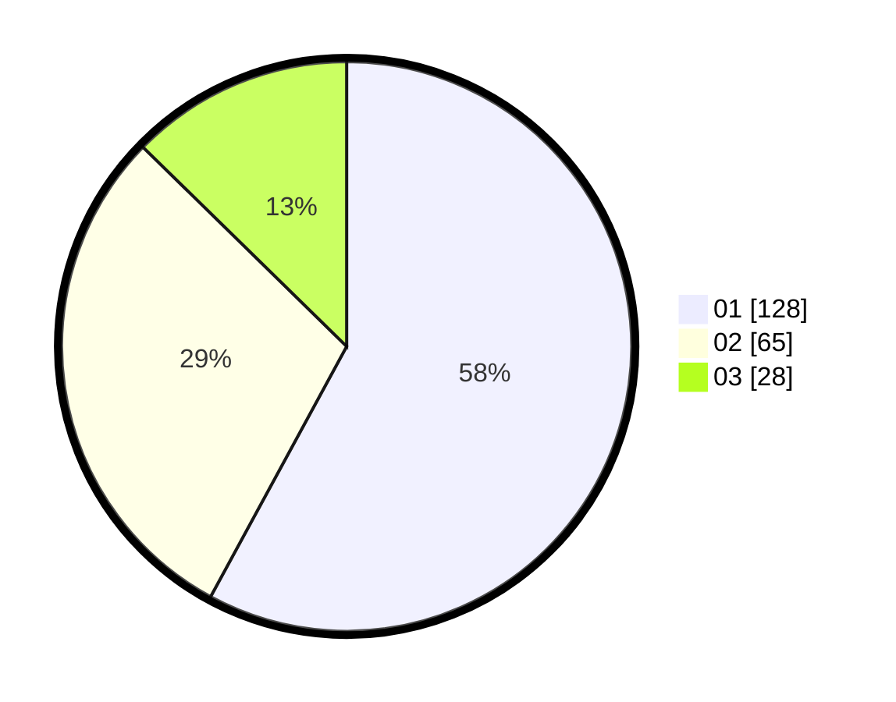

# Hasil

Hasil perolehan suara paslon dapat dilihat pada file paslon-01.txt, paslon-02.txt, dan paslon-03.txt.

Jika tidak ada, artinya data tersebut belum ada pada SIREKAP.

## Perolehan Suara

 * Paslon 01: **128**.
 * Paslon 02: **65**.
 * Paslon 03: **28**.

## Foto C Plano

https://sirekap-obj-formc.kpu.go.id/d478/pemilu/ppwp/31/73/08/10/04/3173081004013-20240214-224132--98e11292-7219-4103-8043-fff7089d8990.jpg

https://sirekap-obj-formc.kpu.go.id/d478/pemilu/ppwp/31/73/08/10/04/3173081004013-20240214-224254--399be8fe-ff6a-4e80-83dd-728ef576dbe4.jpg

https://sirekap-obj-formc.kpu.go.id/d478/pemilu/ppwp/31/73/08/10/04/3173081004013-20240214-224414--f7990600-e6a6-4a1d-b9be-fa408c1c3d98.jpg
