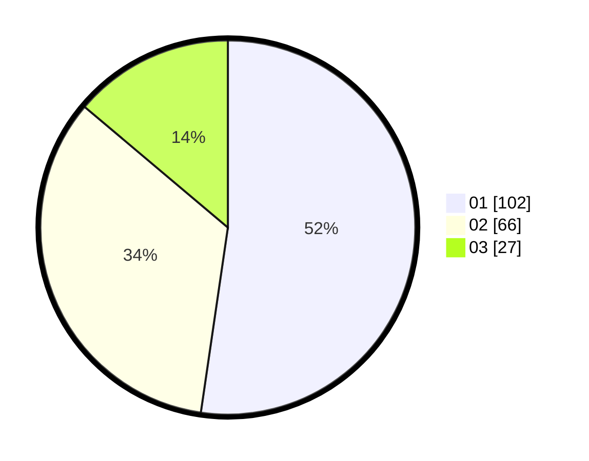

# Hasil

Hasil perolehan suara paslon dapat dilihat pada file paslon-01.txt, paslon-02.txt, dan paslon-03.txt.

Jika tidak ada, artinya data tersebut belum ada pada SIREKAP.

## Perolehan Suara

 * Paslon 01: **102**.
 * Paslon 02: **66**.
 * Paslon 03: **27**.

## Foto C Plano

https://sirekap-obj-formc.kpu.go.id/c593/pemilu/ppwp/31/73/08/10/04/3173081004014-20240214-155137--40133ebc-112c-489b-974f-2e4851a2ee6c.jpg

https://sirekap-obj-formc.kpu.go.id/c593/pemilu/ppwp/31/73/08/10/04/3173081004014-20240214-155144--67512df9-2972-4c69-86c3-5e566a179286.jpg

https://sirekap-obj-formc.kpu.go.id/c593/pemilu/ppwp/31/73/08/10/04/3173081004014-20240214-155132--b942af7e-927c-4669-a3b1-3de9a02c9577.jpg

## DATA PEMILIH TETAP

Jumlah pemilih dalam DPT: **283**.
 * L: **147**.
 * P: **136**.

## DATA PENGGUNA HAK PILIH

Jumlah pengguna hak pilih dalam DPT: **199**.
 * L: **101**.
 * P: **98**.

Jumlah pengguna hak pilih dalam DPTb: **3**.
 * L: **2**.
 * P: **1**.

Jumlah pengguna hak pilih dalam DPK: **0**.
 * L: **0**.
 * P: **0**.

Jumlah pengguna hak pilih: **202**.
 * L: **103**.
 * P: **99**.

## JUMLAH SUARA SAH DAN TIDAK SAH

JUMLAH SELURUH SUARA SAH: **195**.

JUMLAH SUARA TIDAK SAH: **7**.

JUMLAH SELURUH SUARA SAH DAN SUARA TIDAK SAH: **202**.
