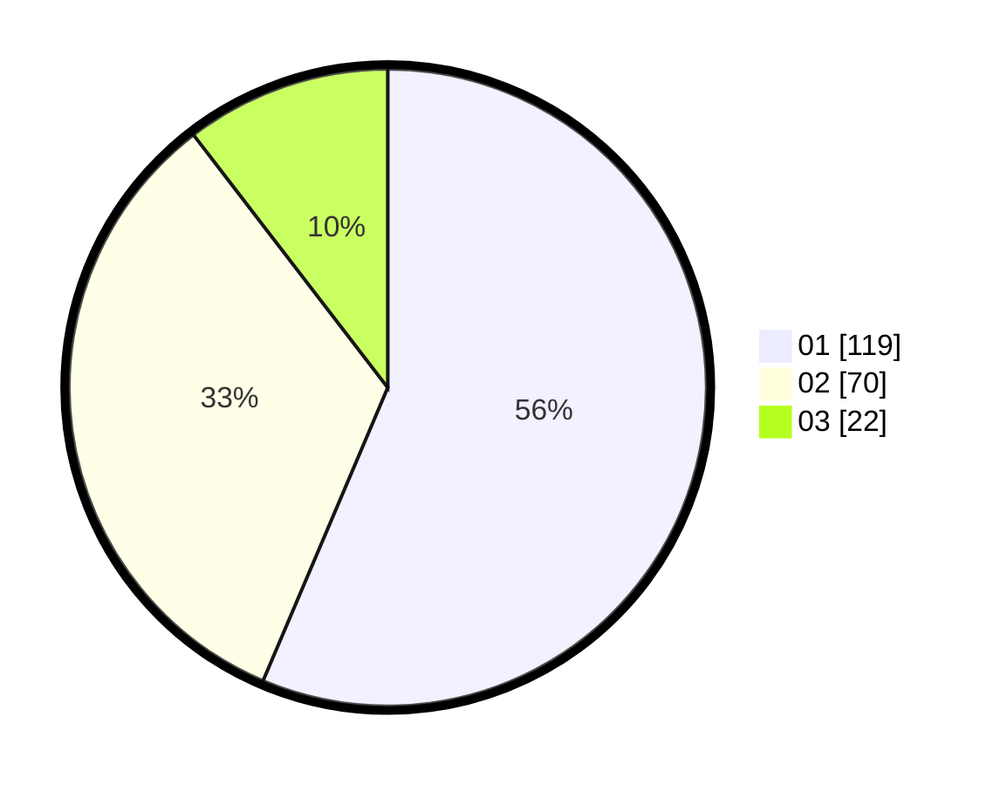

# Hasil

Hasil perolehan suara paslon dapat dilihat pada file paslon-01.txt, paslon-02.txt, dan paslon-03.txt.

Jika tidak ada, artinya data tersebut belum ada pada SIREKAP.

## Perolehan Suara

 * Paslon 01: **119**.
 * Paslon 02: **70**.
 * Paslon 03: **22**.

## Foto C Plano

https://sirekap-obj-formc.kpu.go.id/2acd/pemilu/ppwp/31/73/08/10/04/3173081004018-20240215-003935--a9422678-0cc9-4c14-a0fe-02a84790efa2.jpg

https://sirekap-obj-formc.kpu.go.id/2acd/pemilu/ppwp/31/73/08/10/04/3173081004018-20240214-201429--84688fcf-2588-4ce6-bb43-dabd1598a540.jpg

https://sirekap-obj-formc.kpu.go.id/2acd/pemilu/ppwp/31/73/08/10/04/3173081004018-20240214-201705--61fcff96-0851-4f51-ab39-fa98a5fa709e.jpg

## DATA PEMILIH TETAP

Jumlah pemilih dalam DPT: **278**.
 * L: **135**.
 * P: **143**.

## DATA PENGGUNA HAK PILIH

Jumlah pengguna hak pilih dalam DPT: **208**.
 * L: **96**.
 * P: **112**.

Jumlah pengguna hak pilih dalam DPTb: **7**.
 * L: **1**.
 * P: **6**.

Jumlah pengguna hak pilih dalam DPK: **0**.
 * L: **0**.
 * P: **0**.

Jumlah pengguna hak pilih: **215**.
 * L: **97**.
 * P: **118**.

## JUMLAH SUARA SAH DAN TIDAK SAH

JUMLAH SELURUH SUARA SAH: **211**.

JUMLAH SUARA TIDAK SAH: **4**.

JUMLAH SELURUH SUARA SAH DAN SUARA TIDAK SAH: **215**.
