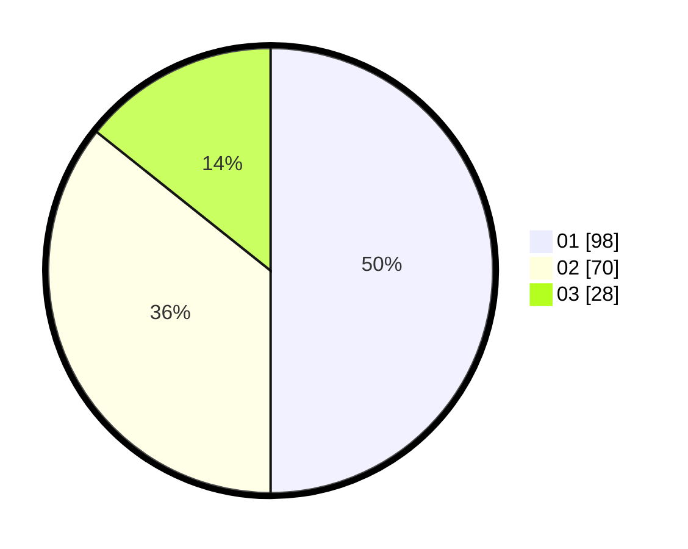

# Hasil

Hasil perolehan suara paslon dapat dilihat pada file paslon-01.txt, paslon-02.txt, dan paslon-03.txt.

Jika tidak ada, artinya data tersebut belum ada pada SIREKAP.

## Perolehan Suara

 * Paslon 01: **98**.
 * Paslon 02: **70**.
 * Paslon 03: **28**.

## Foto C Plano

https://sirekap-obj-formc.kpu.go.id/a712/pemilu/ppwp/31/73/08/10/04/3173081004019-20240214-220248--3326ab51-b69b-465c-bd2f-9c189ee462c8.jpg

https://sirekap-obj-formc.kpu.go.id/a712/pemilu/ppwp/31/73/08/10/04/3173081004019-20240214-221130--2de93093-114d-420b-bcb3-03afd41ab0a3.jpg

https://sirekap-obj-formc.kpu.go.id/a712/pemilu/ppwp/31/73/08/10/04/3173081004019-20240214-221216--613312ad-3529-41ce-8694-f286afd6b609.jpg

## DATA PEMILIH TETAP

Jumlah pemilih dalam DPT: **280**.
 * L: **129**.
 * P: **151**.

## DATA PENGGUNA HAK PILIH

Jumlah pengguna hak pilih dalam DPT: **199**.
 * L: **85**.
 * P: **114**.

Jumlah pengguna hak pilih dalam DPTb: **0**.
 * L: **0**.
 * P: **0**.

Jumlah pengguna hak pilih dalam DPK: **0**.
 * L: **0**.
 * P: **0**.

Jumlah pengguna hak pilih: **199**.
 * L: **85**.
 * P: **114**.

## JUMLAH SUARA SAH DAN TIDAK SAH

JUMLAH SELURUH SUARA SAH: **196**.

JUMLAH SUARA TIDAK SAH: **3**.

JUMLAH SELURUH SUARA SAH DAN SUARA TIDAK SAH: **199**.
