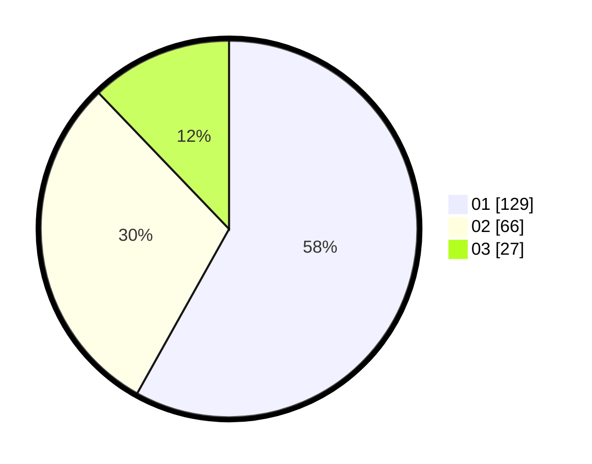

# Hasil

Hasil perolehan suara paslon dapat dilihat pada file paslon-01.txt, paslon-02.txt, dan paslon-03.txt.

Jika tidak ada, artinya data tersebut belum ada pada SIREKAP.

## Perolehan Suara

 * Paslon 01: **129**.
 * Paslon 02: **66**.
 * Paslon 03: **27**.

## Foto C Plano

https://sirekap-obj-formc.kpu.go.id/d419/pemilu/ppwp/31/73/08/10/04/3173081004020-20240214-215413--b9c900fd-4ab6-4cb8-9a8e-5800b6884483.jpg

https://sirekap-obj-formc.kpu.go.id/d419/pemilu/ppwp/31/73/08/10/04/3173081004020-20240214-215531--a7946d4d-4c3b-4228-a5f3-4ad1a76a4f60.jpg

https://sirekap-obj-formc.kpu.go.id/d419/pemilu/ppwp/31/73/08/10/04/3173081004020-20240214-215657--2eb3c4b6-8d78-4ab6-b350-df467fe8bd4b.jpg
