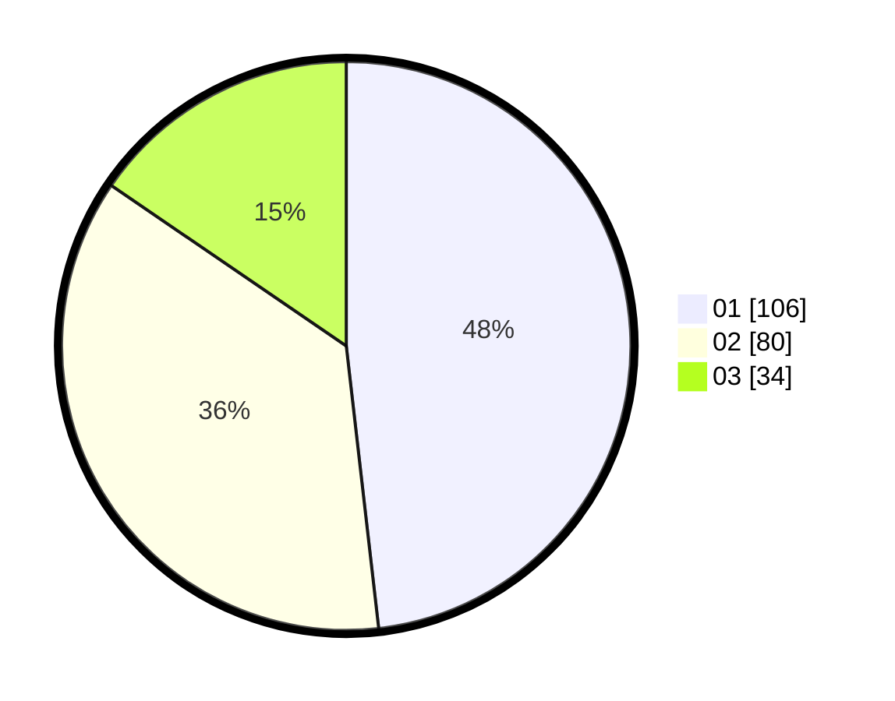

# Hasil

Hasil perolehan suara paslon dapat dilihat pada file paslon-01.txt, paslon-02.txt, dan paslon-03.txt.

Jika tidak ada, artinya data tersebut belum ada pada SIREKAP.

## Perolehan Suara

 * Paslon 01: **106**.
 * Paslon 02: **80**.
 * Paslon 03: **34**.

## Foto C Plano

https://sirekap-obj-formc.kpu.go.id/8fa5/pemilu/ppwp/31/73/08/10/04/3173081004021-20240214-184610--be110e8b-c546-4b04-86c1-44e50be9e62d.jpg

https://sirekap-obj-formc.kpu.go.id/8fa5/pemilu/ppwp/31/73/08/10/04/3173081004021-20240214-184640--d0ac12bb-b0b3-4af3-a8ce-b7898f3e1e74.jpg

https://sirekap-obj-formc.kpu.go.id/8fa5/pemilu/ppwp/31/73/08/10/04/3173081004021-20240214-184724--576f4907-30e8-4dc5-bebf-0f72eef889de.jpg

## DATA PEMILIH TETAP

Jumlah pemilih dalam DPT: **283**.
 * L: **141**.
 * P: **142**.

## DATA PENGGUNA HAK PILIH

Jumlah pengguna hak pilih dalam DPT: **225**.
 * L: **111**.
 * P: **114**.

Jumlah pengguna hak pilih dalam DPTb: **0**.
 * L: **0**.
 * P: **0**.

Jumlah pengguna hak pilih dalam DPK: **2**.
 * L: **0**.
 * P: **2**.

Jumlah pengguna hak pilih: **227**.
 * L: **111**.
 * P: **116**.

## JUMLAH SUARA SAH DAN TIDAK SAH

JUMLAH SELURUH SUARA SAH: **220**.

JUMLAH SUARA TIDAK SAH: **7**.

JUMLAH SELURUH SUARA SAH DAN SUARA TIDAK SAH: **227**.
