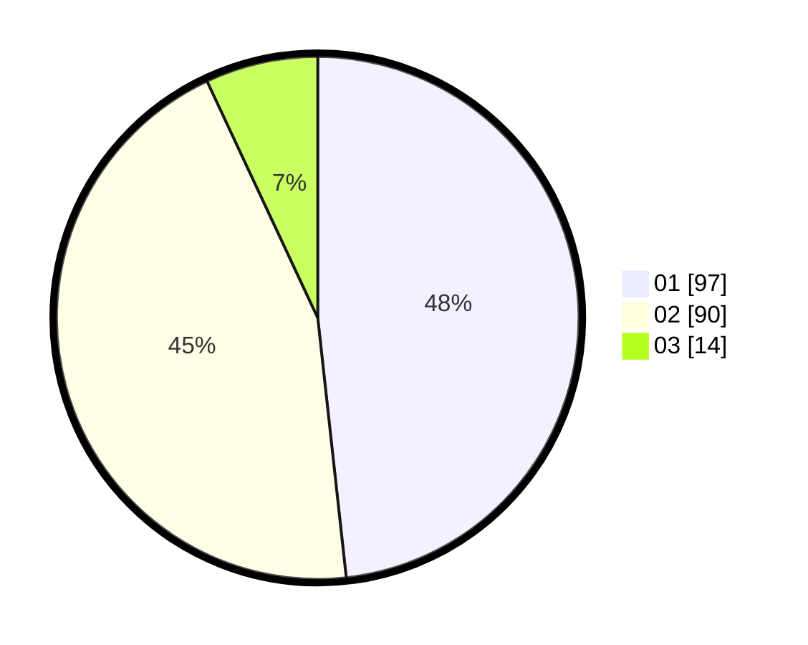

# Hasil

Hasil perolehan suara paslon dapat dilihat pada file paslon-01.txt, paslon-02.txt, dan paslon-03.txt.

Jika tidak ada, artinya data tersebut belum ada pada SIREKAP.

## Perolehan Suara

 * Paslon 01: **97**.
 * Paslon 02: **90**.
 * Paslon 03: **14**.

## Foto C Plano

https://sirekap-obj-formc.kpu.go.id/4116/pemilu/ppwp/31/73/08/10/04/3173081004022-20240214-233243--0d39f959-ab42-4133-8e42-12c7dfed89d1.jpg

https://sirekap-obj-formc.kpu.go.id/4116/pemilu/ppwp/31/73/08/10/04/3173081004022-20240214-234536--8bbb9cf6-1ffb-4fee-af67-97ccd21f18f8.jpg

https://sirekap-obj-formc.kpu.go.id/4116/pemilu/ppwp/31/73/08/10/04/3173081004022-20240214-234552--1e12e3b7-da67-47f0-9e60-ef37f1452f17.jpg
