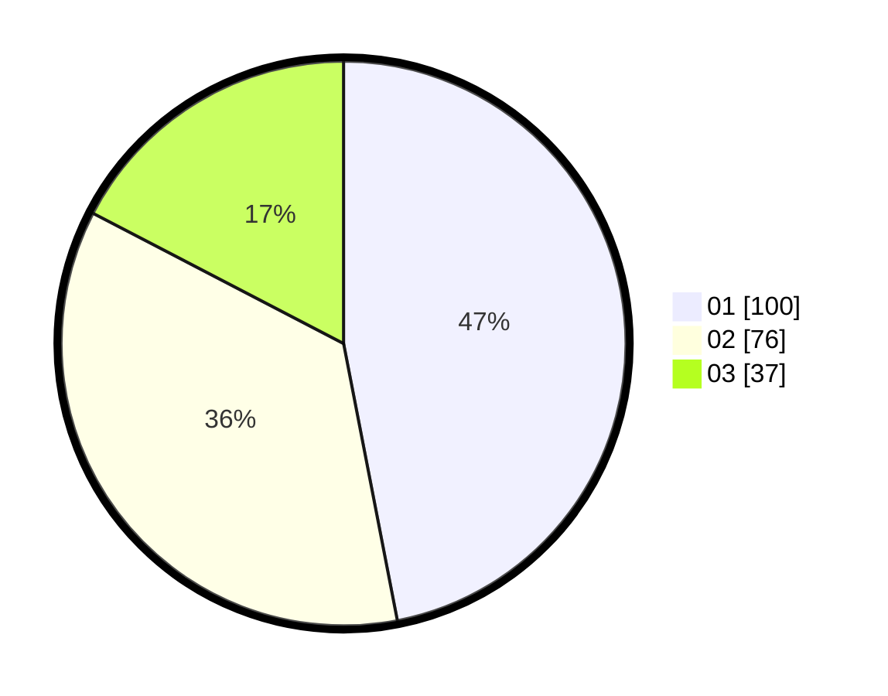

# Hasil

Hasil perolehan suara paslon dapat dilihat pada file paslon-01.txt, paslon-02.txt, dan paslon-03.txt.

Jika tidak ada, artinya data tersebut belum ada pada SIREKAP.

## Perolehan Suara

 * Paslon 01: **100**.
 * Paslon 02: **76**.
 * Paslon 03: **37**.

## Foto C Plano

https://sirekap-obj-formc.kpu.go.id/62a2/pemilu/ppwp/31/73/08/10/04/3173081004023-20240215-050038--599abe81-d423-4bf4-855c-0ff5bfb76e6f.jpg

https://sirekap-obj-formc.kpu.go.id/62a2/pemilu/ppwp/31/73/08/10/04/3173081004023-20240215-050010--0f4cde38-1b9b-49a5-ba4c-dfa33604138d.jpg

https://sirekap-obj-formc.kpu.go.id/62a2/pemilu/ppwp/31/73/08/10/04/3173081004023-20240215-050118--682a55da-f2e7-4b62-9cad-63f5dee9a30b.jpg
