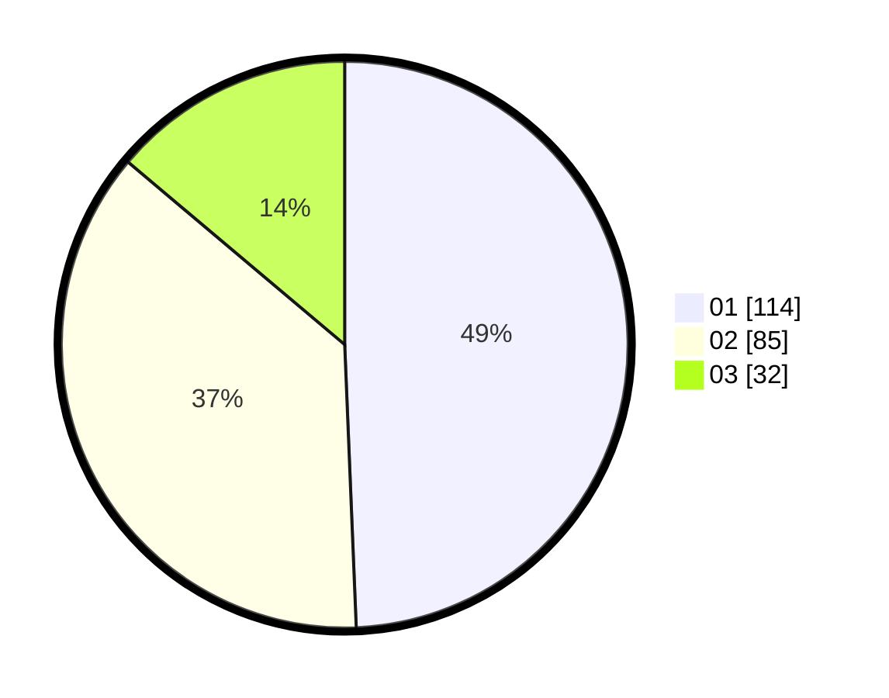

# Hasil

Hasil perolehan suara paslon dapat dilihat pada file paslon-01.txt, paslon-02.txt, dan paslon-03.txt.

Jika tidak ada, artinya data tersebut belum ada pada SIREKAP.

## Perolehan Suara

 * Paslon 01: **114**.
 * Paslon 02: **85**.
 * Paslon 03: **32**.

## Foto C Plano

https://sirekap-obj-formc.kpu.go.id/b58b/pemilu/ppwp/31/73/08/10/04/3173081004024-20240214-233633--552f46ae-3a7a-4533-9c47-aeffbdf1d6a5.jpg

https://sirekap-obj-formc.kpu.go.id/b58b/pemilu/ppwp/31/73/08/10/04/3173081004024-20240214-233815--080a2805-bde8-4048-a92c-8bca10b0bee5.jpg

https://sirekap-obj-formc.kpu.go.id/b58b/pemilu/ppwp/31/73/08/10/04/3173081004024-20240214-233919--b908ceb7-76a1-4e4d-8e77-4cb0cd8a021d.jpg

## DATA PEMILIH TETAP

Jumlah pemilih dalam DPT: **279**.
 * L: **134**.
 * P: **145**.

## DATA PENGGUNA HAK PILIH

Jumlah pengguna hak pilih dalam DPT: **218**.
 * L: **107**.
 * P: **111**.

Jumlah pengguna hak pilih dalam DPTb: **17**.
 * L: **5**.
 * P: **12**.

Jumlah pengguna hak pilih dalam DPK: **0**.
 * L: **0**.
 * P: **0**.

Jumlah pengguna hak pilih: **235**.
 * L: **112**.
 * P: **123**.

## JUMLAH SUARA SAH DAN TIDAK SAH

JUMLAH SELURUH SUARA SAH: **231**.

JUMLAH SUARA TIDAK SAH: **4**.

JUMLAH SELURUH SUARA SAH DAN SUARA TIDAK SAH: **235**.
