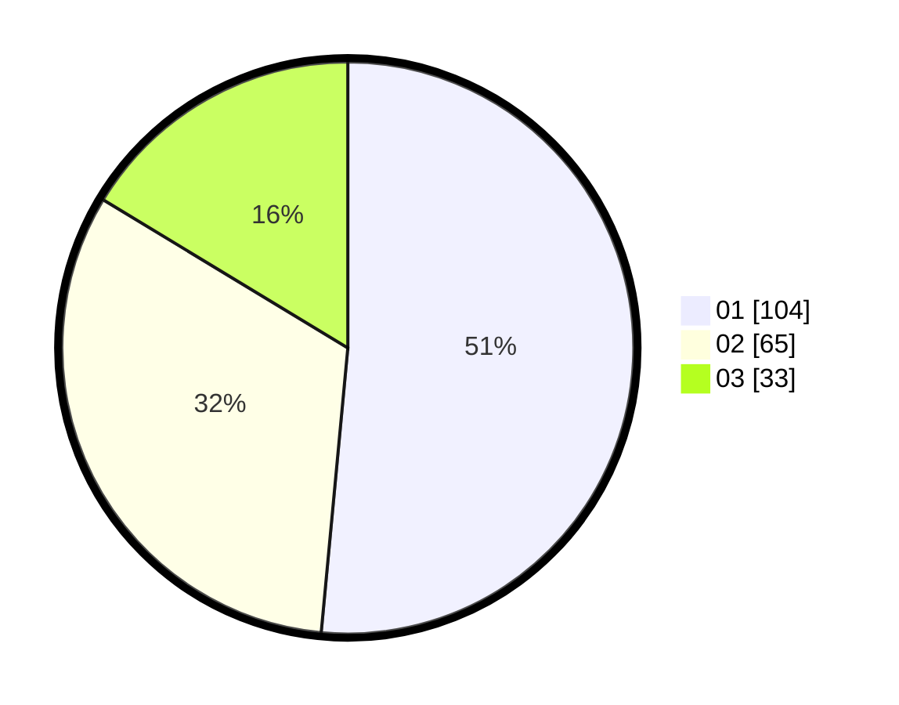

# Hasil

Hasil perolehan suara paslon dapat dilihat pada file paslon-01.txt, paslon-02.txt, dan paslon-03.txt.

Jika tidak ada, artinya data tersebut belum ada pada SIREKAP.

## Perolehan Suara

 * Paslon 01: **104**.
 * Paslon 02: **65**.
 * Paslon 03: **33**.

## Foto C Plano

https://sirekap-obj-formc.kpu.go.id/3c3e/pemilu/ppwp/31/73/08/10/04/3173081004026-20240214-234243--a6ea8dc8-a603-456c-b81f-11a9c3cedb83.jpg

https://sirekap-obj-formc.kpu.go.id/3c3e/pemilu/ppwp/31/73/08/10/04/3173081004026-20240214-234247--a994daf1-92a1-48d2-8804-93251bac818c.jpg

https://sirekap-obj-formc.kpu.go.id/3c3e/pemilu/ppwp/31/73/08/10/04/3173081004026-20240214-234255--b35a1157-554a-45c6-b8c7-40d0a14443ea.jpg
