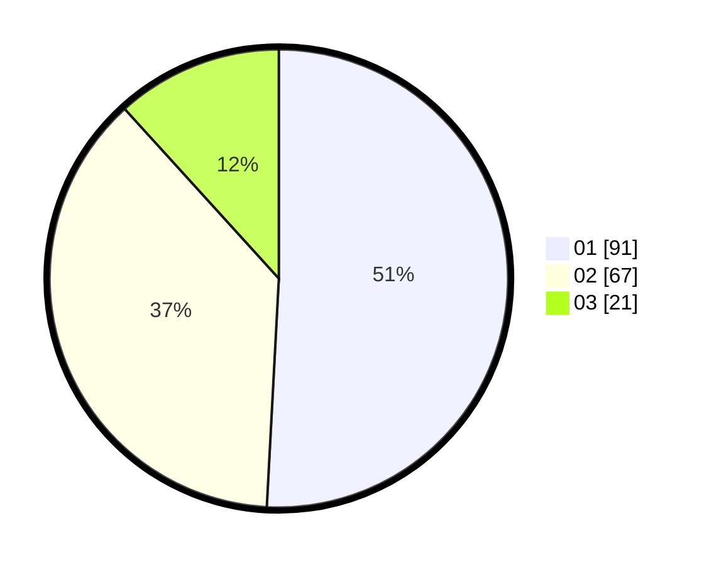

# Hasil

Hasil perolehan suara paslon dapat dilihat pada file paslon-01.txt, paslon-02.txt, dan paslon-03.txt.

Jika tidak ada, artinya data tersebut belum ada pada SIREKAP.

## Perolehan Suara

 * Paslon 01: **91**.
 * Paslon 02: **67**.
 * Paslon 03: **21**.

## Foto C Plano

https://sirekap-obj-formc.kpu.go.id/ace2/pemilu/ppwp/31/73/08/10/04/3173081004028-20240214-212224--e0cd481d-e98f-4ab7-927e-1871413a5ab9.jpg

https://sirekap-obj-formc.kpu.go.id/ace2/pemilu/ppwp/31/73/08/10/04/3173081004028-20240214-212540--73a1ef90-16d9-45b2-b6f7-efec24031ba5.jpg
