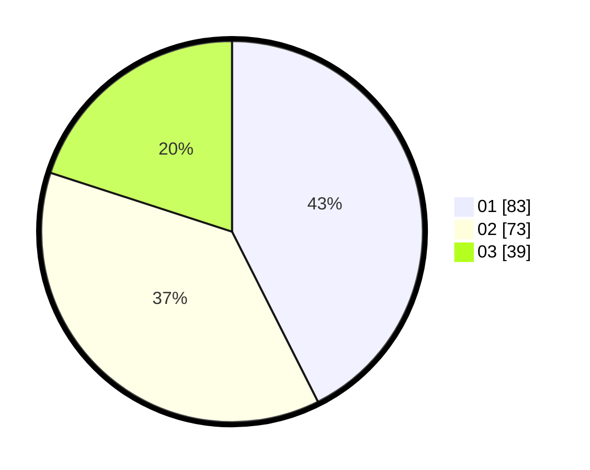

# Hasil

Hasil perolehan suara paslon dapat dilihat pada file paslon-01.txt, paslon-02.txt, dan paslon-03.txt.

Jika tidak ada, artinya data tersebut belum ada pada SIREKAP.

## Perolehan Suara

 * Paslon 01: **83**.
 * Paslon 02: **73**.
 * Paslon 03: **39**.

## Foto C Plano

https://sirekap-obj-formc.kpu.go.id/88bf/pemilu/ppwp/31/73/08/10/04/3173081004030-20240214-211606--c764816a-3d41-4fe6-b0bc-a99dea30a03e.jpg

https://sirekap-obj-formc.kpu.go.id/88bf/pemilu/ppwp/31/73/08/10/04/3173081004030-20240214-211915--fd17108f-8a34-49df-9576-7c2d0258d002.jpg

https://sirekap-obj-formc.kpu.go.id/88bf/pemilu/ppwp/31/73/08/10/04/3173081004030-20240214-212055--be631b5b-cc15-4368-90f3-b487843b2d4f.jpg
