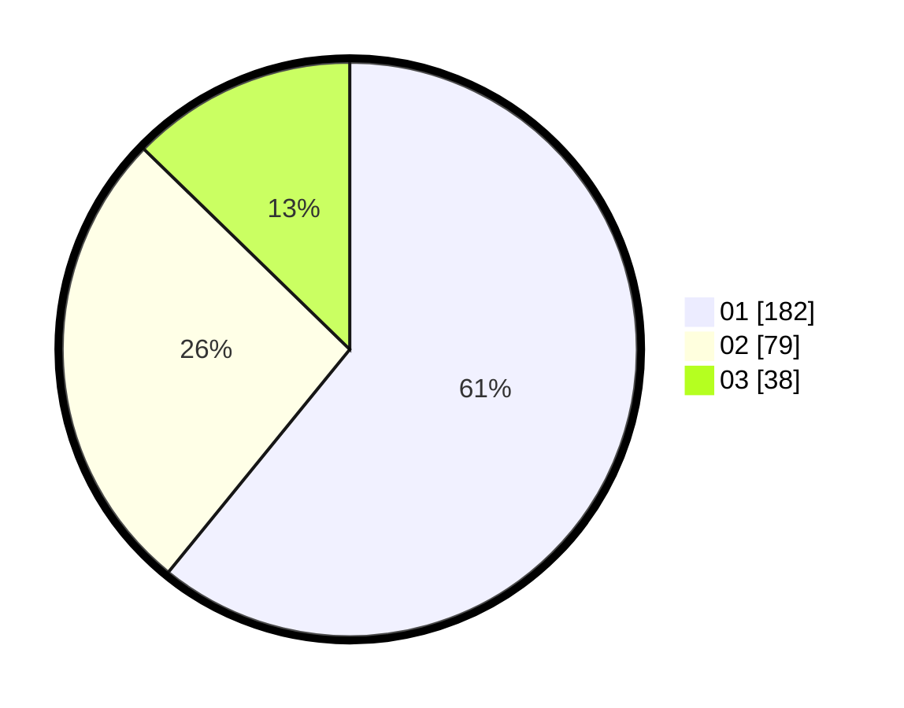

# Hasil

Hasil perolehan suara paslon dapat dilihat pada file paslon-01.txt, paslon-02.txt, dan paslon-03.txt.

Jika tidak ada, artinya data tersebut belum ada pada SIREKAP.

## Perolehan Suara

 * Paslon 01: **182**.
 * Paslon 02: **79**.
 * Paslon 03: **38**.

## Foto C Plano

https://sirekap-obj-formc.kpu.go.id/47da/pemilu/ppwp/31/73/08/10/04/3173081004031-20240214-204621--7bc4e1d7-8743-449a-86e3-732d370f99f7.jpg

https://sirekap-obj-formc.kpu.go.id/47da/pemilu/ppwp/31/73/08/10/04/3173081004031-20240214-210226--48bffa25-e736-45c8-a274-0f5c36bc0645.jpg

https://sirekap-obj-formc.kpu.go.id/47da/pemilu/ppwp/31/73/08/10/04/3173081004031-20240214-210535--aaac5560-759f-453f-aeca-e1b341bd7159.jpg
