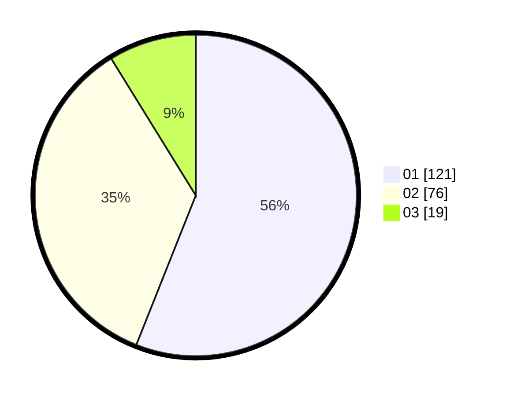

# Hasil

Hasil perolehan suara paslon dapat dilihat pada file paslon-01.txt, paslon-02.txt, dan paslon-03.txt.

Jika tidak ada, artinya data tersebut belum ada pada SIREKAP.

## Perolehan Suara

 * Paslon 01: **121**.
 * Paslon 02: **76**.
 * Paslon 03: **19**.

## Foto C Plano

https://sirekap-obj-formc.kpu.go.id/e9c8/pemilu/ppwp/31/73/08/10/04/3173081004033-20240214-233421--6dd5a07d-5ae3-44a6-be2c-4cabc2407980.jpg

https://sirekap-obj-formc.kpu.go.id/e9c8/pemilu/ppwp/31/73/08/10/04/3173081004033-20240214-203800--3d257c03-99c3-4884-b84a-f64567ff5d4c.jpg

https://sirekap-obj-formc.kpu.go.id/e9c8/pemilu/ppwp/31/73/08/10/04/3173081004033-20240214-204033--31fd8988-de96-434a-9767-a19941c0fa64.jpg

## DATA PEMILIH TETAP

Jumlah pemilih dalam DPT: **278**.
 * L: **134**.
 * P: **144**.

## DATA PENGGUNA HAK PILIH

Jumlah pengguna hak pilih dalam DPT: **213**.
 * L: **95**.
 * P: **118**.

Jumlah pengguna hak pilih dalam DPTb: **7**.
 * L: **2**.
 * P: **5**.

Jumlah pengguna hak pilih dalam DPK: **0**.
 * L: **0**.
 * P: **0**.

Jumlah pengguna hak pilih: **220**.
 * L: **97**.
 * P: **123**.

## JUMLAH SUARA SAH DAN TIDAK SAH

JUMLAH SELURUH SUARA SAH: **216**.

JUMLAH SUARA TIDAK SAH: **4**.

JUMLAH SELURUH SUARA SAH DAN SUARA TIDAK SAH: **220**.
