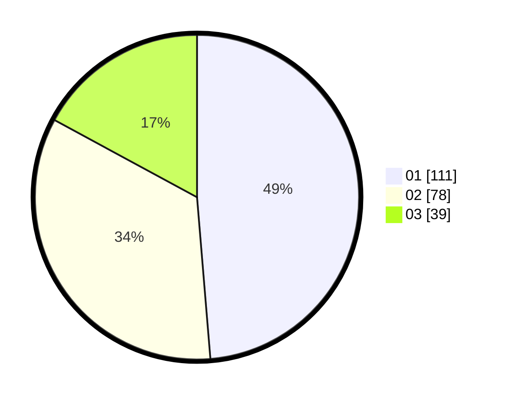

# Hasil

Hasil perolehan suara paslon dapat dilihat pada file paslon-01.txt, paslon-02.txt, dan paslon-03.txt.

Jika tidak ada, artinya data tersebut belum ada pada SIREKAP.

## Perolehan Suara

 * Paslon 01: **111**.
 * Paslon 02: **78**.
 * Paslon 03: **39**.

## Foto C Plano

https://sirekap-obj-formc.kpu.go.id/cdc7/pemilu/ppwp/31/73/08/10/04/3173081004035-20240215-001828--e39de296-103c-48c0-a8ab-248570748053.jpg

https://sirekap-obj-formc.kpu.go.id/cdc7/pemilu/ppwp/31/73/08/10/04/3173081004035-20240215-001928--70157bb2-b3c0-4260-a5d4-a7c396ce3723.jpg

https://sirekap-obj-formc.kpu.go.id/cdc7/pemilu/ppwp/31/73/08/10/04/3173081004035-20240215-002015--68cc4843-29ea-4b21-a4aa-d474121c17f9.jpg
