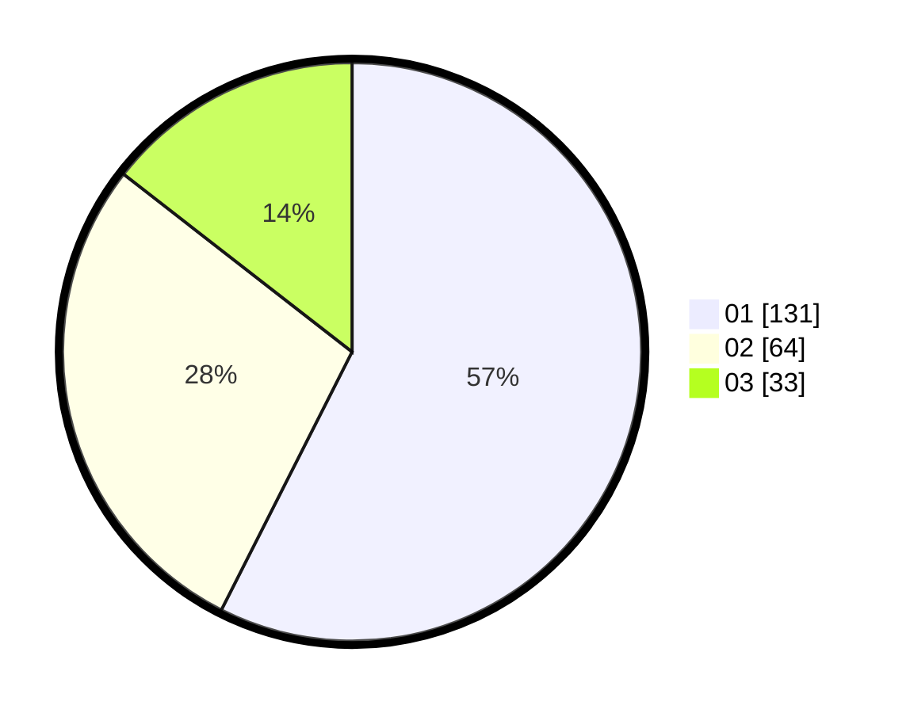

# Hasil

Hasil perolehan suara paslon dapat dilihat pada file paslon-01.txt, paslon-02.txt, dan paslon-03.txt.

Jika tidak ada, artinya data tersebut belum ada pada SIREKAP.

## Perolehan Suara

 * Paslon 01: **131**.
 * Paslon 02: **64**.
 * Paslon 03: **33**.

## Foto C Plano

https://sirekap-obj-formc.kpu.go.id/a6b8/pemilu/ppwp/31/73/08/10/04/3173081004038-20240214-210653--0ff5b852-c1e8-477d-86d1-b473aa3aefd9.jpg

https://sirekap-obj-formc.kpu.go.id/a6b8/pemilu/ppwp/31/73/08/10/04/3173081004038-20240214-210848--978e5247-e2a6-4494-b902-5ed8ad95674a.jpg

https://sirekap-obj-formc.kpu.go.id/a6b8/pemilu/ppwp/31/73/08/10/04/3173081004038-20240214-211004--464b959e-1e37-40dd-bb7c-5d830378d043.jpg
