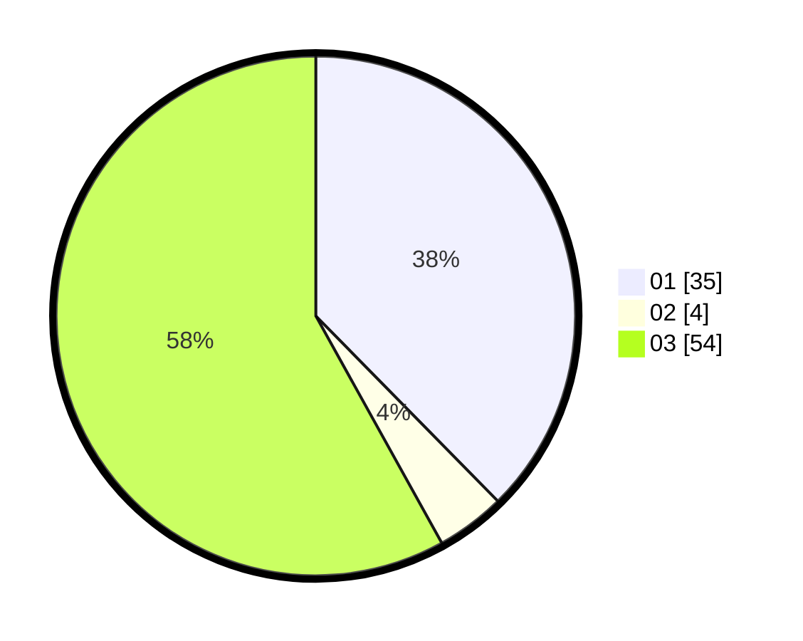

# Hasil

Hasil perolehan suara paslon dapat dilihat pada file paslon-01.txt, paslon-02.txt, dan paslon-03.txt.

Jika tidak ada, artinya data tersebut belum ada pada SIREKAP.

## Perolehan Suara

 * Paslon 01: **35**.
 * Paslon 02: **4**.
 * Paslon 03: **54**.

## Foto C Plano

https://sirekap-obj-formc.kpu.go.id/f60a/pemilu/ppwp/31/73/08/10/04/3173081004044-20240214-190009--0e874a5b-b39d-404a-8faa-02768fb84ff5.jpg

https://sirekap-obj-formc.kpu.go.id/f60a/pemilu/ppwp/31/73/08/10/04/3173081004044-20240214-190848--2ecc072c-43c2-4da2-a9f4-383d99f1db99.jpg

https://sirekap-obj-formc.kpu.go.id/f60a/pemilu/ppwp/31/73/08/10/04/3173081004044-20240214-190020--5f7f8723-9da4-47cb-8b45-d2028fd724dc.jpg

## DATA PEMILIH TETAP

Jumlah pemilih dalam DPT: **241**.
 * L: **116**.
 * P: **125**.

## DATA PENGGUNA HAK PILIH

Jumlah pengguna hak pilih dalam DPT: **161**.
 * L: **74**.
 * P: **87**.

Jumlah pengguna hak pilih dalam DPTb: **5**.
 * L: **2**.
 * P: **3**.

Jumlah pengguna hak pilih dalam DPK: **6**.
 * L: **3**.
 * P: **3**.

Jumlah pengguna hak pilih: **172**.
 * L: **79**.
 * P: **93**.

## JUMLAH SUARA SAH DAN TIDAK SAH

JUMLAH SELURUH SUARA SAH: **170**.

JUMLAH SUARA TIDAK SAH: **2**.

JUMLAH SELURUH SUARA SAH DAN SUARA TIDAK SAH: **176**.
