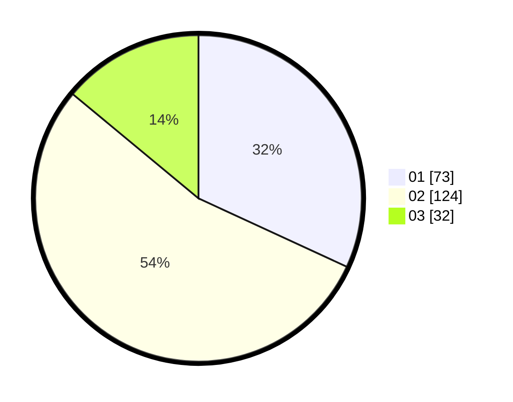

# Hasil

Hasil perolehan suara paslon dapat dilihat pada file paslon-01.txt, paslon-02.txt, dan paslon-03.txt.

Jika tidak ada, artinya data tersebut belum ada pada SIREKAP.

## Perolehan Suara

 * Paslon 01: **73**.
 * Paslon 02: **124**.
 * Paslon 03: **32**.

## Foto C Plano

https://sirekap-obj-formc.kpu.go.id/129f/pemilu/ppwp/31/73/08/10/04/3173081004048-20240214-231254--8c8f236b-4410-4f57-a105-7de0d40a774b.jpg

https://sirekap-obj-formc.kpu.go.id/129f/pemilu/ppwp/31/73/08/10/04/3173081004048-20240214-231302--5842184c-f11d-4e4c-96cc-aab3b71b0b13.jpg

https://sirekap-obj-formc.kpu.go.id/129f/pemilu/ppwp/31/73/08/10/04/3173081004048-20240214-231308--94b96830-ea8d-4105-9b49-308fa3c34ca2.jpg
