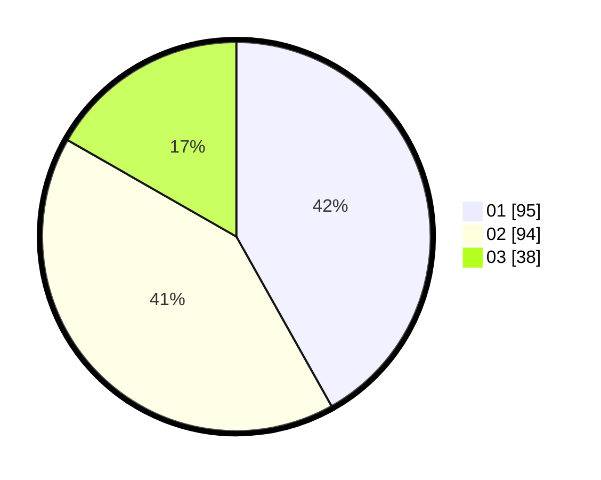

# Hasil

Hasil perolehan suara paslon dapat dilihat pada file paslon-01.txt, paslon-02.txt, dan paslon-03.txt.

Jika tidak ada, artinya data tersebut belum ada pada SIREKAP.

## Perolehan Suara

 * Paslon 01: **95**.
 * Paslon 02: **94**.
 * Paslon 03: **38**.

## Foto C Plano

https://sirekap-obj-formc.kpu.go.id/bef8/pemilu/ppwp/31/73/08/10/04/3173081004049-20240217-124722--759e6b6b-59cf-4bb2-a3f6-08133ecf0148.jpg

https://sirekap-obj-formc.kpu.go.id/bef8/pemilu/ppwp/31/73/08/10/04/3173081004049-20240217-124811--1340b9cc-a7fa-4059-925a-d3234fd4d281.jpg

https://sirekap-obj-formc.kpu.go.id/bef8/pemilu/ppwp/31/73/08/10/04/3173081004049-20240217-124847--110a219e-8363-4d10-bcf3-77fe99dea471.jpg
