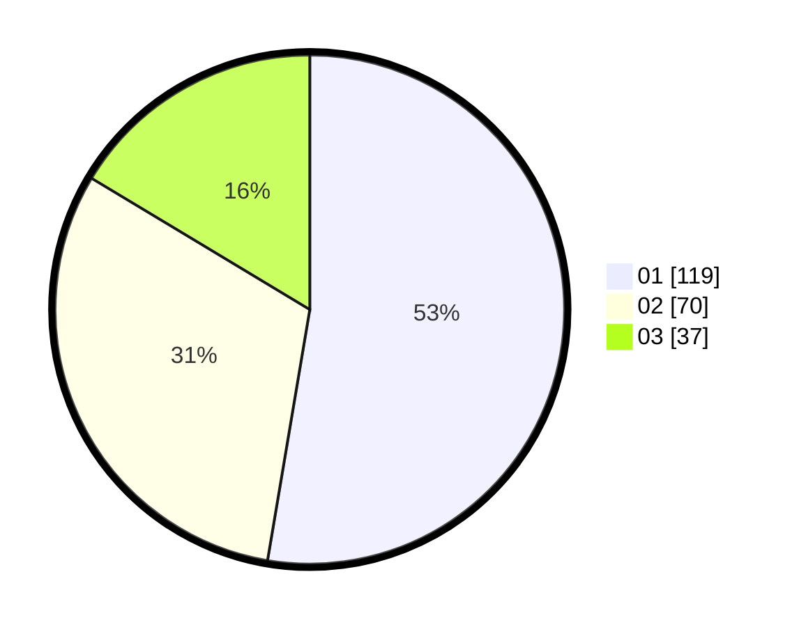

# Hasil

Hasil perolehan suara paslon dapat dilihat pada file paslon-01.txt, paslon-02.txt, dan paslon-03.txt.

Jika tidak ada, artinya data tersebut belum ada pada SIREKAP.

## Perolehan Suara

 * Paslon 01: **119**.
 * Paslon 02: **70**.
 * Paslon 03: **37**.

## Foto C Plano

https://sirekap-obj-formc.kpu.go.id/b05c/pemilu/ppwp/31/73/08/10/04/3173081004050-20240215-020023--10a170ff-892a-4a97-929d-595a3d40cc61.jpg

https://sirekap-obj-formc.kpu.go.id/b05c/pemilu/ppwp/31/73/08/10/04/3173081004050-20240215-020033--764ffa89-7360-47de-ae1d-9dd0d059092c.jpg

https://sirekap-obj-formc.kpu.go.id/b05c/pemilu/ppwp/31/73/08/10/04/3173081004050-20240215-020043--128b7a99-1e9d-4a58-874f-9d8ab2ab9562.jpg

## DATA PEMILIH TETAP

Jumlah pemilih dalam DPT: **277**.
 * L: **132**.
 * P: **145**.

## DATA PENGGUNA HAK PILIH

Jumlah pengguna hak pilih dalam DPT: **218**.
 * L: **105**.
 * P: **113**.

Jumlah pengguna hak pilih dalam DPTb: **1**.
 * L: **1**.
 * P: **0**.

Jumlah pengguna hak pilih dalam DPK: **8**.
 * L: **3**.
 * P: **5**.

Jumlah pengguna hak pilih: **227**.
 * L: **109**.
 * P: **118**.

## JUMLAH SUARA SAH DAN TIDAK SAH

JUMLAH SELURUH SUARA SAH: **226**.

JUMLAH SUARA TIDAK SAH: **1**.

JUMLAH SELURUH SUARA SAH DAN SUARA TIDAK SAH: **227**.
