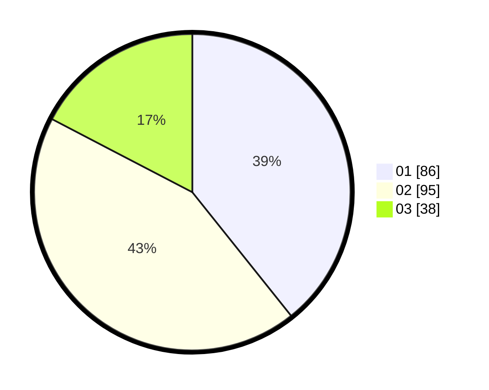

# Hasil

Hasil perolehan suara paslon dapat dilihat pada file paslon-01.txt, paslon-02.txt, dan paslon-03.txt.

Jika tidak ada, artinya data tersebut belum ada pada SIREKAP.

## Perolehan Suara

 * Paslon 01: **86**.
 * Paslon 02: **95**.
 * Paslon 03: **38**.

## Foto C Plano

https://sirekap-obj-formc.kpu.go.id/10d5/pemilu/ppwp/31/73/08/10/04/3173081004051-20240217-202650--2fd66090-a86b-48a3-8a1f-0d712704c1e2.jpg

https://sirekap-obj-formc.kpu.go.id/10d5/pemilu/ppwp/31/73/08/10/04/3173081004051-20240217-205616--baa4af04-3909-4d43-b2eb-feb63809975a.jpg

https://sirekap-obj-formc.kpu.go.id/10d5/pemilu/ppwp/31/73/08/10/04/3173081004051-20240217-214641--d957ce94-bae3-418f-8c78-b4fb18646b38.jpg

## DATA PEMILIH TETAP

Jumlah pemilih dalam DPT: **287**.
 * L: **141**.
 * P: **146**.

## DATA PENGGUNA HAK PILIH

Jumlah pengguna hak pilih dalam DPT: **215**.
 * L: **99**.
 * P: **116**.

Jumlah pengguna hak pilih dalam DPTb: **1**.
 * L: **0**.
 * P: **1**.

Jumlah pengguna hak pilih dalam DPK: **4**.
 * L: **4**.
 * P: **0**.

Jumlah pengguna hak pilih: **220**.
 * L: **103**.
 * P: **117**.

## JUMLAH SUARA SAH DAN TIDAK SAH

JUMLAH SELURUH SUARA SAH: **219**.

JUMLAH SUARA TIDAK SAH: **1**.

JUMLAH SELURUH SUARA SAH DAN SUARA TIDAK SAH: **220**.
