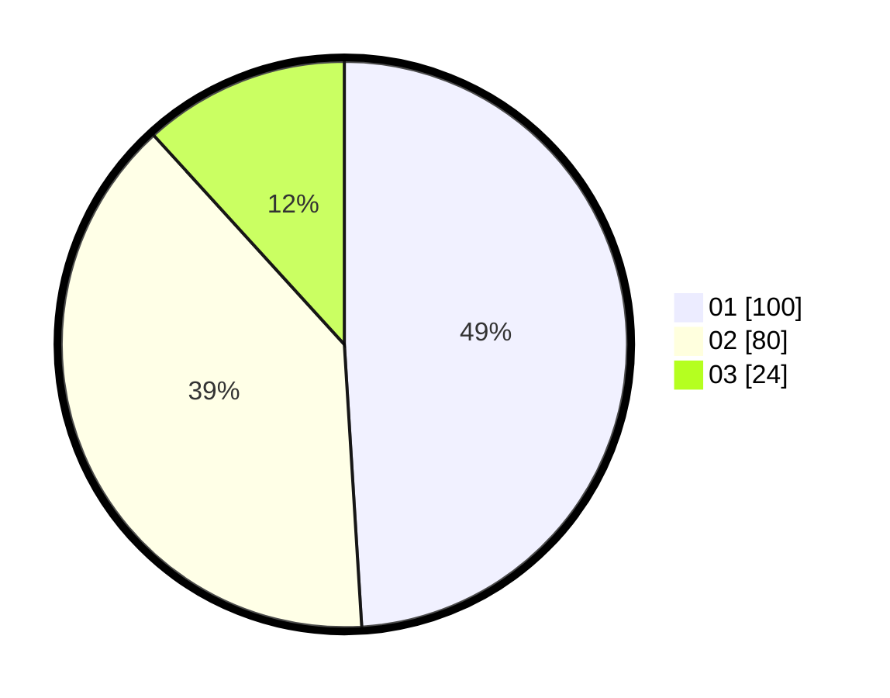

# Hasil

Hasil perolehan suara paslon dapat dilihat pada file paslon-01.txt, paslon-02.txt, dan paslon-03.txt.

Jika tidak ada, artinya data tersebut belum ada pada SIREKAP.

## Perolehan Suara

 * Paslon 01: **100**.
 * Paslon 02: **80**.
 * Paslon 03: **24**.

## Foto C Plano

https://sirekap-obj-formc.kpu.go.id/5923/pemilu/ppwp/31/73/08/10/04/3173081004053-20240215-222309--9f28aacc-d93d-4b11-ad5f-41c2dc3b5330.jpg

https://sirekap-obj-formc.kpu.go.id/5923/pemilu/ppwp/31/73/08/10/04/3173081004053-20240214-230538--0ab65643-c776-45ef-a026-78aea96d4d57.jpg

https://sirekap-obj-formc.kpu.go.id/5923/pemilu/ppwp/31/73/08/10/04/3173081004053-20240215-001236--964b3570-eeeb-4638-98eb-f1772217cfcd.jpg
