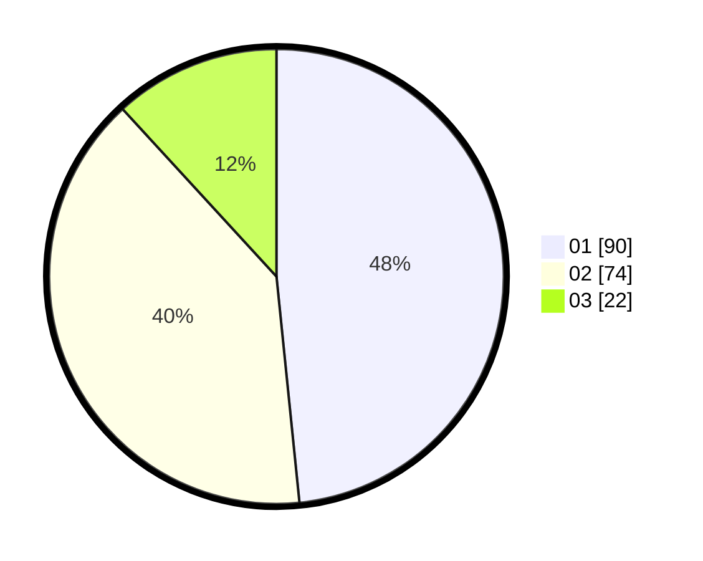

# Hasil

Hasil perolehan suara paslon dapat dilihat pada file paslon-01.txt, paslon-02.txt, dan paslon-03.txt.

Jika tidak ada, artinya data tersebut belum ada pada SIREKAP.

## Perolehan Suara

 * Paslon 01: **90**.
 * Paslon 02: **74**.
 * Paslon 03: **22**.

## Foto C Plano

https://sirekap-obj-formc.kpu.go.id/382f/pemilu/ppwp/31/73/08/10/04/3173081004057-20240217-153218--b307ad79-5d17-48ec-aba2-59e9a0ee6aab.jpg

https://sirekap-obj-formc.kpu.go.id/382f/pemilu/ppwp/31/73/08/10/04/3173081004057-20240219-173033--778cbc0b-33f6-47e2-bf1a-7d5894df85cb.jpg

https://sirekap-obj-formc.kpu.go.id/382f/pemilu/ppwp/31/73/08/10/04/3173081004057-20240217-152914--e4f0e468-bfba-4b2c-89df-74eeb3965e78.jpg

## DATA PEMILIH TETAP

Jumlah pemilih dalam DPT: **231**.
 * L: **112**.
 * P: **119**.

## DATA PENGGUNA HAK PILIH

Jumlah pengguna hak pilih dalam DPT: **182**.
 * L: **84**.
 * P: **98**.

Jumlah pengguna hak pilih dalam DPTb: **4**.
 * L: **2**.
 * P: **2**.

Jumlah pengguna hak pilih dalam DPK: **1**.
 * L: **0**.
 * P: **1**.

Jumlah pengguna hak pilih: **187**.
 * L: **86**.
 * P: **101**.

## JUMLAH SUARA SAH DAN TIDAK SAH

JUMLAH SELURUH SUARA SAH: **186**.

JUMLAH SUARA TIDAK SAH: **1**.

JUMLAH SELURUH SUARA SAH DAN SUARA TIDAK SAH: **187**.
