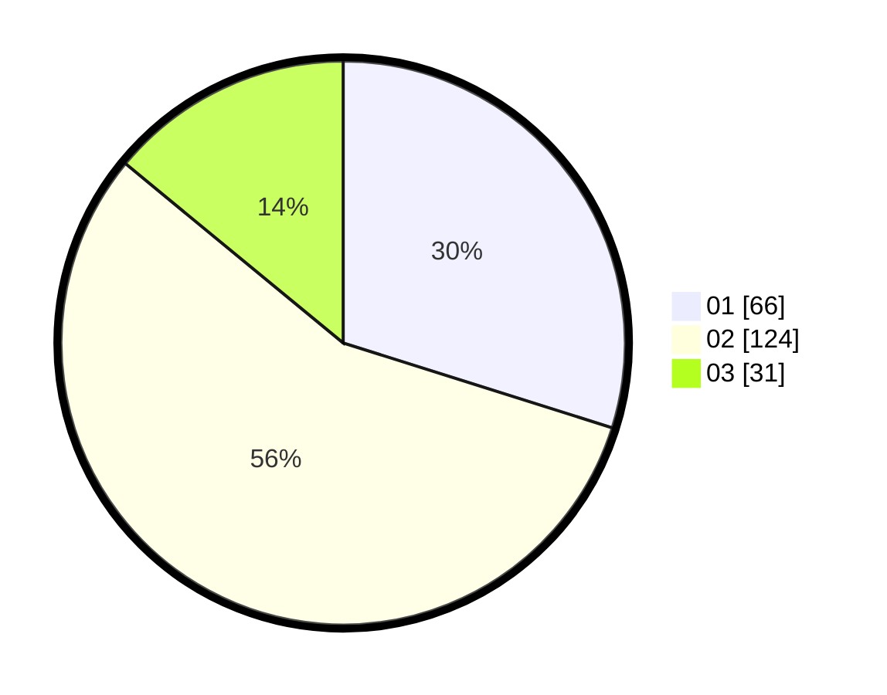

# Hasil

Hasil perolehan suara paslon dapat dilihat pada file paslon-01.txt, paslon-02.txt, dan paslon-03.txt.

Jika tidak ada, artinya data tersebut belum ada pada SIREKAP.

## Perolehan Suara

 * Paslon 01: **66**.
 * Paslon 02: **124**.
 * Paslon 03: **31**.

## Foto C Plano

https://sirekap-obj-formc.kpu.go.id/6978/pemilu/ppwp/31/73/08/10/04/3173081004067-20240214-230640--6d21335f-3188-40d5-9ea3-8c6c1a138ab7.jpg

https://sirekap-obj-formc.kpu.go.id/6978/pemilu/ppwp/31/73/08/10/04/3173081004067-20240214-234524--28edf429-7298-4c0c-8560-53e501765ce6.jpg
