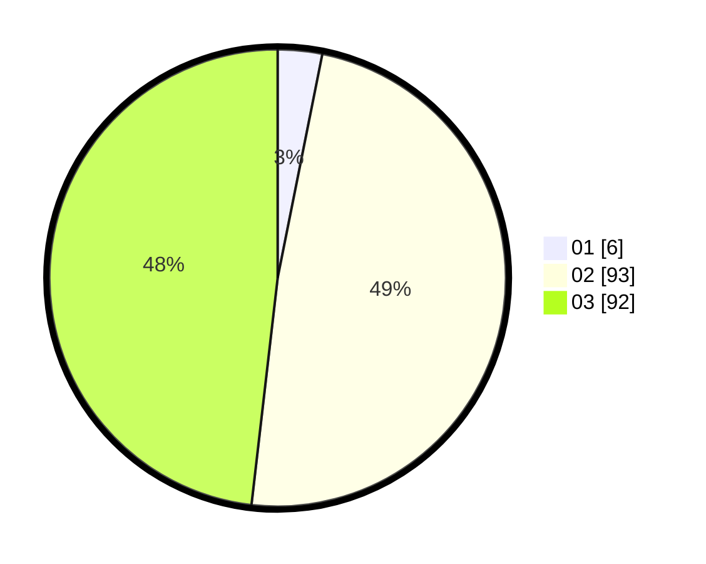

# Hasil

Hasil perolehan suara paslon dapat dilihat pada file paslon-01.txt, paslon-02.txt, dan paslon-03.txt.

Jika tidak ada, artinya data tersebut belum ada pada SIREKAP.

## Perolehan Suara

 * Paslon 01: **6**.
 * Paslon 02: **93**.
 * Paslon 03: **92**.

## Foto C Plano

https://sirekap-obj-formc.kpu.go.id/f902/pemilu/ppwp/31/73/08/10/04/3173081004068-20240214-221342--ec81c7fd-4126-4660-b4f5-d00ff955b0ef.jpg

https://sirekap-obj-formc.kpu.go.id/f902/pemilu/ppwp/31/73/08/10/04/3173081004068-20240214-221422--80c131ec-8050-4190-b61b-99521983e88b.jpg

https://sirekap-obj-formc.kpu.go.id/f902/pemilu/ppwp/31/73/08/10/04/3173081004068-20240214-221511--44f3ef9b-302a-440d-9254-a26adb2fac72.jpg
