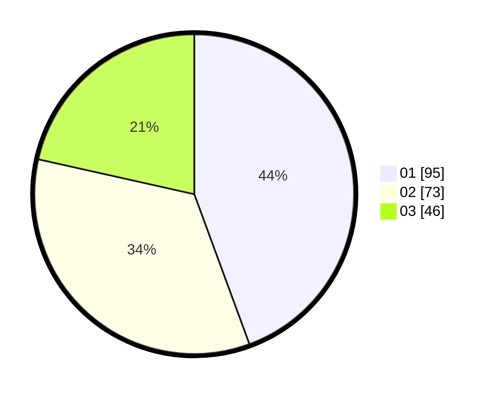

# Hasil

Hasil perolehan suara paslon dapat dilihat pada file paslon-01.txt, paslon-02.txt, dan paslon-03.txt.

Jika tidak ada, artinya data tersebut belum ada pada SIREKAP.

## Perolehan Suara

 * Paslon 01: **95**.
 * Paslon 02: **73**.
 * Paslon 03: **46**.

## Foto C Plano

https://sirekap-obj-formc.kpu.go.id/f7de/pemilu/ppwp/31/73/08/10/04/3173081004069-20240214-234409--de14b45a-38d5-4b3c-8919-f20a66144814.jpg

https://sirekap-obj-formc.kpu.go.id/f7de/pemilu/ppwp/31/73/08/10/04/3173081004069-20240214-234739--50f47e3b-d1be-45c4-86e6-9962d31c3541.jpg

https://sirekap-obj-formc.kpu.go.id/f7de/pemilu/ppwp/31/73/08/10/04/3173081004069-20240214-234904--ae468e48-5191-4e1b-b5f8-cfad94a77db8.jpg
