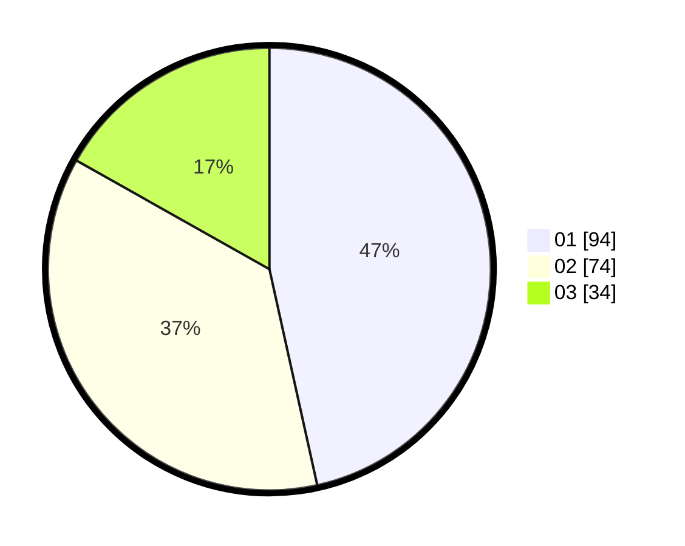

# Hasil

Hasil perolehan suara paslon dapat dilihat pada file paslon-01.txt, paslon-02.txt, dan paslon-03.txt.

Jika tidak ada, artinya data tersebut belum ada pada SIREKAP.

## Perolehan Suara

 * Paslon 01: **94**.
 * Paslon 02: **74**.
 * Paslon 03: **34**.

## Foto C Plano

https://sirekap-obj-formc.kpu.go.id/9894/pemilu/ppwp/31/73/08/10/04/3173081004072-20240215-003836--31fc26f5-3c32-44e7-8d2d-7e13d445496d.jpg

https://sirekap-obj-formc.kpu.go.id/9894/pemilu/ppwp/31/73/08/10/04/3173081004072-20240215-003932--a52f0709-73a6-4abb-be55-7acf0abb1941.jpg

https://sirekap-obj-formc.kpu.go.id/9894/pemilu/ppwp/31/73/08/10/04/3173081004072-20240215-004023--a4c58f69-bb6f-43e1-894d-1ad7b88a16b4.jpg

## DATA PEMILIH TETAP

Jumlah pemilih dalam DPT: **292**.
 * L: **153**.
 * P: **139**.

## DATA PENGGUNA HAK PILIH

Jumlah pengguna hak pilih dalam DPT: **203**.
 * L: **103**.
 * P: **100**.

Jumlah pengguna hak pilih dalam DPTb: **1**.
 * L: **0**.
 * P: **1**.

Jumlah pengguna hak pilih dalam DPK: **1**.
 * L: **0**.
 * P: **1**.

Jumlah pengguna hak pilih: **205**.
 * L: **103**.
 * P: **102**.

## JUMLAH SUARA SAH DAN TIDAK SAH

JUMLAH SELURUH SUARA SAH: **202**.

JUMLAH SUARA TIDAK SAH: **3**.

JUMLAH SELURUH SUARA SAH DAN SUARA TIDAK SAH: **205**.
