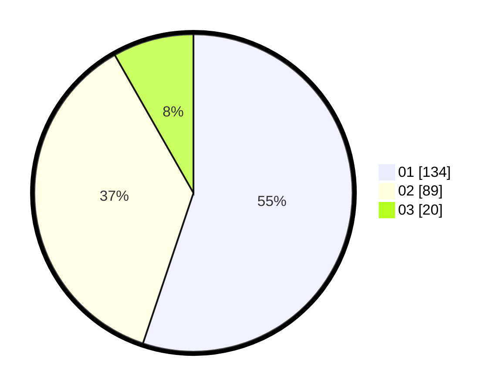

# Hasil

Hasil perolehan suara paslon dapat dilihat pada file paslon-01.txt, paslon-02.txt, dan paslon-03.txt.

Jika tidak ada, artinya data tersebut belum ada pada SIREKAP.

## Perolehan Suara

 * Paslon 01: **134**.
 * Paslon 02: **89**.
 * Paslon 03: **20**.

## Foto C Plano

https://sirekap-obj-formc.kpu.go.id/9398/pemilu/ppwp/31/73/08/10/04/3173081004073-20240216-061115--57a84213-fea0-42eb-b666-eec2d8180ace.jpg

https://sirekap-obj-formc.kpu.go.id/9398/pemilu/ppwp/31/73/08/10/04/3173081004073-20240215-204415--70bec90b-6f04-4dc4-8059-f2a4089da288.jpg

https://sirekap-obj-formc.kpu.go.id/9398/pemilu/ppwp/31/73/08/10/04/3173081004073-20240216-060600--4cb6b899-be20-46dd-a83c-de0ea1611cbf.jpg

## DATA PEMILIH TETAP

Jumlah pemilih dalam DPT: **296**.
 * L: **156**.
 * P: **140**.

## DATA PENGGUNA HAK PILIH

Jumlah pengguna hak pilih dalam DPT: **245**.
 * L: **122**.
 * P: **123**.

Jumlah pengguna hak pilih dalam DPTb: **245**.
 * L: **122**.
 * P: **123**.

Jumlah pengguna hak pilih dalam DPK: **1**.
 * L: **0**.
 * P: **1**.

Jumlah pengguna hak pilih: **246**.
 * L: **122**.
 * P: **123**.

## JUMLAH SUARA SAH DAN TIDAK SAH

JUMLAH SELURUH SUARA SAH: **243**.

JUMLAH SUARA TIDAK SAH: **3**.

JUMLAH SELURUH SUARA SAH DAN SUARA TIDAK SAH: **246**.
