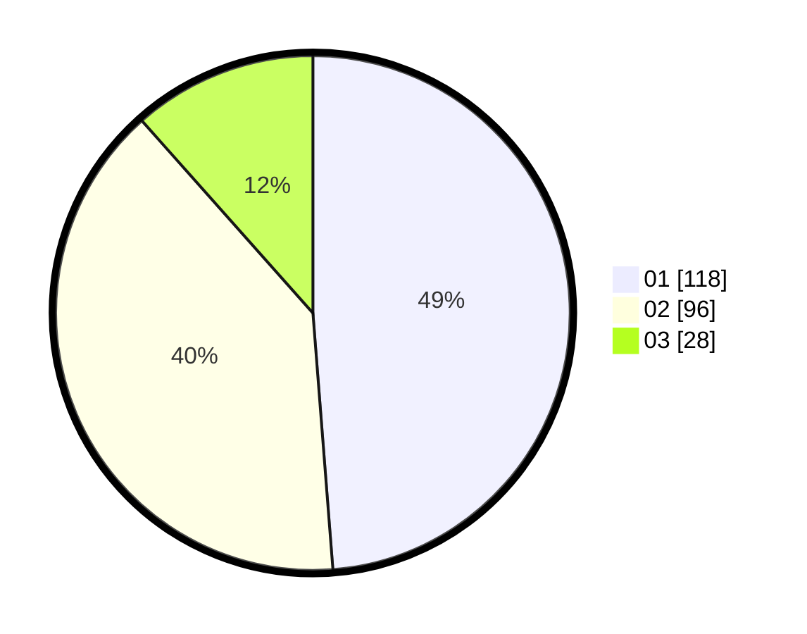

# Hasil

Hasil perolehan suara paslon dapat dilihat pada file paslon-01.txt, paslon-02.txt, dan paslon-03.txt.

Jika tidak ada, artinya data tersebut belum ada pada SIREKAP.

## Perolehan Suara

 * Paslon 01: **118**.
 * Paslon 02: **96**.
 * Paslon 03: **28**.

## Foto C Plano

https://sirekap-obj-formc.kpu.go.id/3d86/pemilu/ppwp/31/73/08/10/04/3173081004074-20240215-013215--6227279e-8716-4499-8514-980967dbbc11.jpg

https://sirekap-obj-formc.kpu.go.id/3d86/pemilu/ppwp/31/73/08/10/04/3173081004074-20240215-013307--44ecdcdd-daad-47a2-bbbc-ab7aaff49d9e.jpg

https://sirekap-obj-formc.kpu.go.id/3d86/pemilu/ppwp/31/73/08/10/04/3173081004074-20240215-013354--edcf0176-9907-48b7-b5e2-ad71c343c48b.jpg
