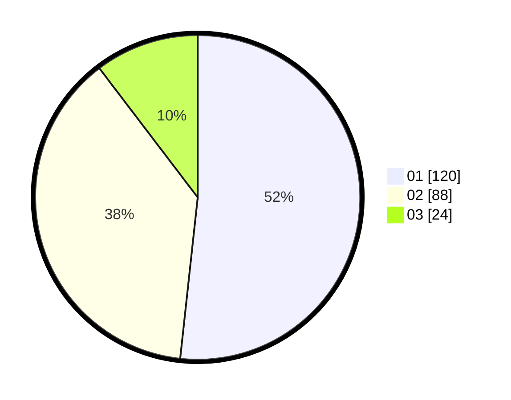

# Hasil

Hasil perolehan suara paslon dapat dilihat pada file paslon-01.txt, paslon-02.txt, dan paslon-03.txt.

Jika tidak ada, artinya data tersebut belum ada pada SIREKAP.

## Perolehan Suara

 * Paslon 01: **120**.
 * Paslon 02: **88**.
 * Paslon 03: **24**.

## Foto C Plano

https://sirekap-obj-formc.kpu.go.id/c098/pemilu/ppwp/31/73/08/10/04/3173081004075-20240214-230555--c70ef31d-28c1-49b0-b293-63674bd5b4ab.jpg

https://sirekap-obj-formc.kpu.go.id/c098/pemilu/ppwp/31/73/08/10/04/3173081004075-20240214-230712--21565202-e322-4051-8bd9-266cc117c789.jpg
