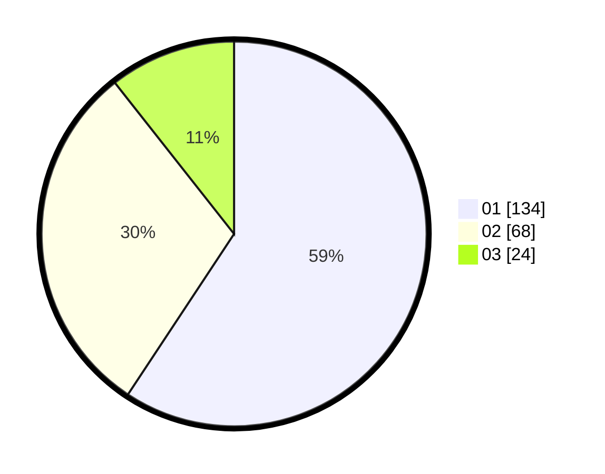

# Hasil

Hasil perolehan suara paslon dapat dilihat pada file paslon-01.txt, paslon-02.txt, dan paslon-03.txt.

Jika tidak ada, artinya data tersebut belum ada pada SIREKAP.

## Perolehan Suara

 * Paslon 01: **134**.
 * Paslon 02: **68**.
 * Paslon 03: **24**.

## Foto C Plano

https://sirekap-obj-formc.kpu.go.id/513c/pemilu/ppwp/31/73/08/10/04/3173081004078-20240214-225733--ab90608f-5376-4fe0-8eee-b76400130145.jpg

https://sirekap-obj-formc.kpu.go.id/513c/pemilu/ppwp/31/73/08/10/04/3173081004078-20240214-225807--3eb24685-9c1c-4693-9b27-bc45d73b3f41.jpg

https://sirekap-obj-formc.kpu.go.id/513c/pemilu/ppwp/31/73/08/10/04/3173081004078-20240214-225838--ef9c0326-846d-47fa-a50a-90ec86569e17.jpg
