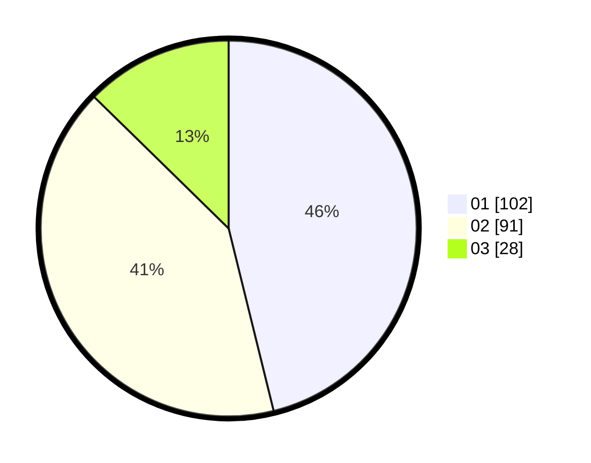

# Hasil

Hasil perolehan suara paslon dapat dilihat pada file paslon-01.txt, paslon-02.txt, dan paslon-03.txt.

Jika tidak ada, artinya data tersebut belum ada pada SIREKAP.

## Perolehan Suara

 * Paslon 01: **102**.
 * Paslon 02: **91**.
 * Paslon 03: **28**.

## Foto C Plano

https://sirekap-obj-formc.kpu.go.id/aa16/pemilu/ppwp/31/73/08/10/04/3173081004081-20240215-235342--5289c781-78c1-4aa8-aaa9-d40463f37f3a.jpg

https://sirekap-obj-formc.kpu.go.id/aa16/pemilu/ppwp/31/73/08/10/04/3173081004081-20240215-235345--ca658303-11eb-432a-9b11-cea17c33d1d5.jpg

https://sirekap-obj-formc.kpu.go.id/aa16/pemilu/ppwp/31/73/08/10/04/3173081004081-20240215-235344--1296a809-e70c-4a58-b837-bdc6c487a5a2.jpg

## DATA PEMILIH TETAP

Jumlah pemilih dalam DPT: **279**.
 * L: **136**.
 * P: **143**.

## DATA PENGGUNA HAK PILIH

Jumlah pengguna hak pilih dalam DPT: **220**.
 * L: **103**.
 * P: **117**.

Jumlah pengguna hak pilih dalam DPTb: **2**.
 * L: **2**.
 * P: **0**.

Jumlah pengguna hak pilih dalam DPK: **0**.
 * L: **0**.
 * P: **0**.

Jumlah pengguna hak pilih: **222**.
 * L: **105**.
 * P: **117**.

## JUMLAH SUARA SAH DAN TIDAK SAH

JUMLAH SELURUH SUARA SAH: **221**.

JUMLAH SUARA TIDAK SAH: **1**.

JUMLAH SELURUH SUARA SAH DAN SUARA TIDAK SAH: **222**.
