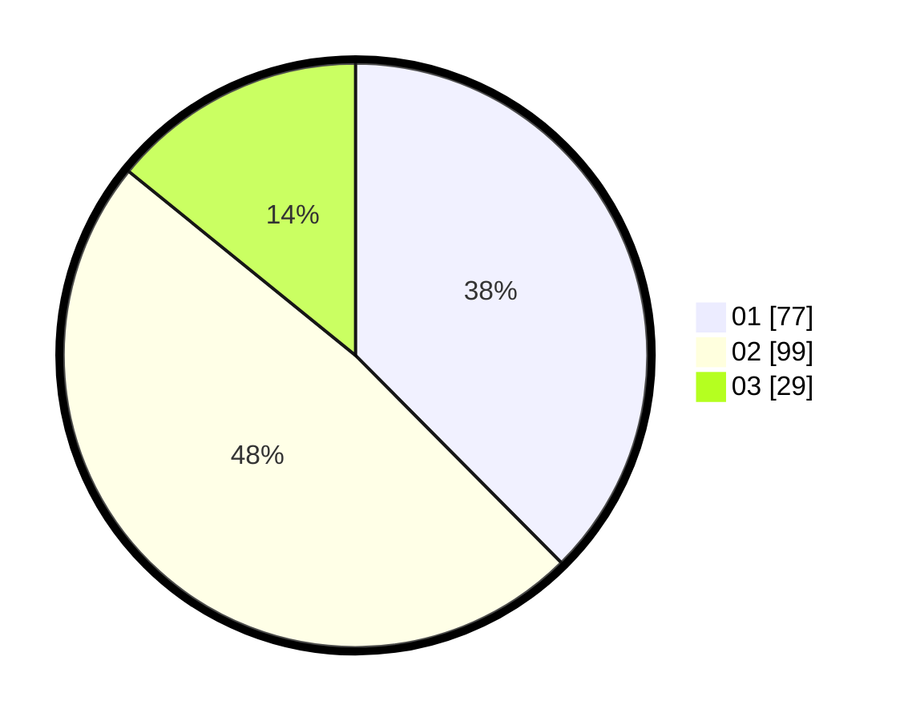

# Hasil

Hasil perolehan suara paslon dapat dilihat pada file paslon-01.txt, paslon-02.txt, dan paslon-03.txt.

Jika tidak ada, artinya data tersebut belum ada pada SIREKAP.

## Perolehan Suara

 * Paslon 01: **77**.
 * Paslon 02: **99**.
 * Paslon 03: **29**.

## Foto C Plano

https://sirekap-obj-formc.kpu.go.id/d7d7/pemilu/ppwp/31/73/08/10/04/3173081004082-20240214-233222--c4b297f2-70ce-44fe-a902-2665e17c4d4f.jpg

https://sirekap-obj-formc.kpu.go.id/d7d7/pemilu/ppwp/31/73/08/10/04/3173081004082-20240214-233349--f7c4a342-704b-4287-8c39-8fa0a56f582c.jpg

https://sirekap-obj-formc.kpu.go.id/d7d7/pemilu/ppwp/31/73/08/10/04/3173081004082-20240214-233443--e5f8c874-dd32-4f94-94d6-4608afcb0edf.jpg
