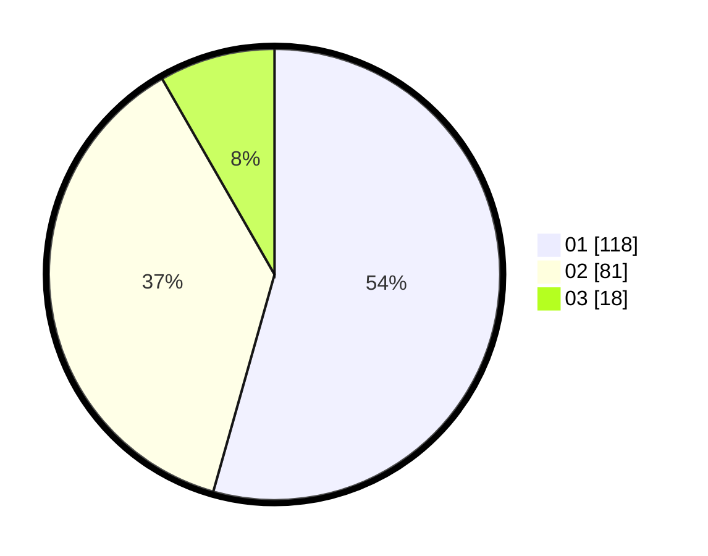

# Hasil

Hasil perolehan suara paslon dapat dilihat pada file paslon-01.txt, paslon-02.txt, dan paslon-03.txt.

Jika tidak ada, artinya data tersebut belum ada pada SIREKAP.

## Perolehan Suara

 * Paslon 01: **118**.
 * Paslon 02: **81**.
 * Paslon 03: **18**.

## Foto C Plano

https://sirekap-obj-formc.kpu.go.id/b523/pemilu/ppwp/31/73/08/10/04/3173081004083-20240214-215150--c3d2cc6e-2718-439d-92ce-078a7b639a4d.jpg

https://sirekap-obj-formc.kpu.go.id/b523/pemilu/ppwp/31/73/08/10/04/3173081004083-20240214-210037--2fe0c440-c501-4c57-afdd-82bf25662aaf.jpg

https://sirekap-obj-formc.kpu.go.id/b523/pemilu/ppwp/31/73/08/10/04/3173081004083-20240214-210133--c2e21b28-3c79-45e5-b837-31a9ce69de46.jpg
