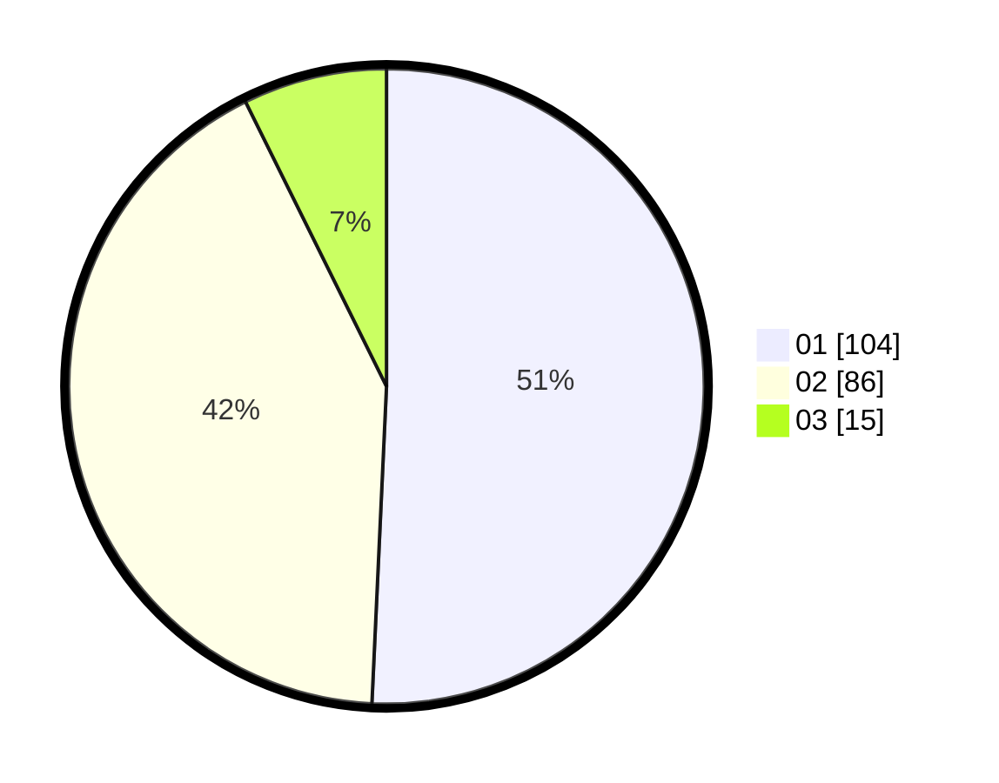

# Hasil

Hasil perolehan suara paslon dapat dilihat pada file paslon-01.txt, paslon-02.txt, dan paslon-03.txt.

Jika tidak ada, artinya data tersebut belum ada pada SIREKAP.

## Perolehan Suara

 * Paslon 01: **104**.
 * Paslon 02: **86**.
 * Paslon 03: **15**.

## Foto C Plano

https://sirekap-obj-formc.kpu.go.id/3183/pemilu/ppwp/31/73/08/10/04/3173081004084-20240214-224053--5f6c2182-237d-4d6d-bcf4-0bb0adc88341.jpg

https://sirekap-obj-formc.kpu.go.id/3183/pemilu/ppwp/31/73/08/10/04/3173081004084-20240214-213453--4f8f32cd-3b63-42c2-9fd2-27694235f26d.jpg

https://sirekap-obj-formc.kpu.go.id/3183/pemilu/ppwp/31/73/08/10/04/3173081004084-20240214-200839--e621bb34-145e-41cb-bd45-f8feb2b36af7.jpg
