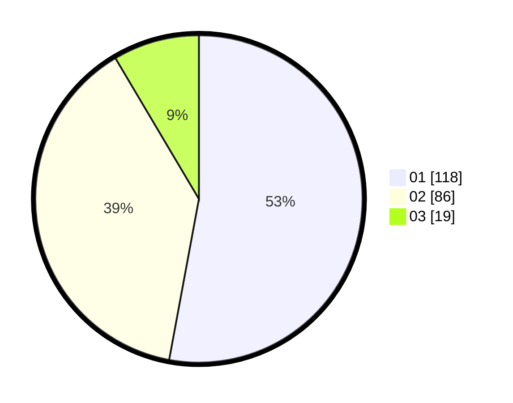

# Hasil

Hasil perolehan suara paslon dapat dilihat pada file paslon-01.txt, paslon-02.txt, dan paslon-03.txt.

Jika tidak ada, artinya data tersebut belum ada pada SIREKAP.

## Perolehan Suara

 * Paslon 01: **118**.
 * Paslon 02: **86**.
 * Paslon 03: **19**.

## Foto C Plano

https://sirekap-obj-formc.kpu.go.id/cf64/pemilu/ppwp/31/73/08/10/04/3173081004086-20240216-115301--287947ec-f196-482a-b4d9-80e33133c1ef.jpg

https://sirekap-obj-formc.kpu.go.id/cf64/pemilu/ppwp/31/73/08/10/04/3173081004086-20240216-093555--cbe3a4a4-36a7-4e76-93f7-ebd8484deecb.jpg

https://sirekap-obj-formc.kpu.go.id/cf64/pemilu/ppwp/31/73/08/10/04/3173081004086-20240216-115306--17092875-b0a1-4593-a0ca-eee8874791b0.jpg

## DATA PEMILIH TETAP

Jumlah pemilih dalam DPT: **293**.
 * L: **153**.
 * P: **140**.

## DATA PENGGUNA HAK PILIH

Jumlah pengguna hak pilih dalam DPT: **229**.
 * L: **117**.
 * P: **112**.

Jumlah pengguna hak pilih dalam DPTb: **0**.
 * L: **0**.
 * P: **0**.

Jumlah pengguna hak pilih dalam DPK: **0**.
 * L: **0**.
 * P: **0**.

Jumlah pengguna hak pilih: **229**.
 * L: **117**.
 * P: **112**.

## JUMLAH SUARA SAH DAN TIDAK SAH

JUMLAH SELURUH SUARA SAH: **223**.

JUMLAH SUARA TIDAK SAH: **6**.

JUMLAH SELURUH SUARA SAH DAN SUARA TIDAK SAH: **229**.
