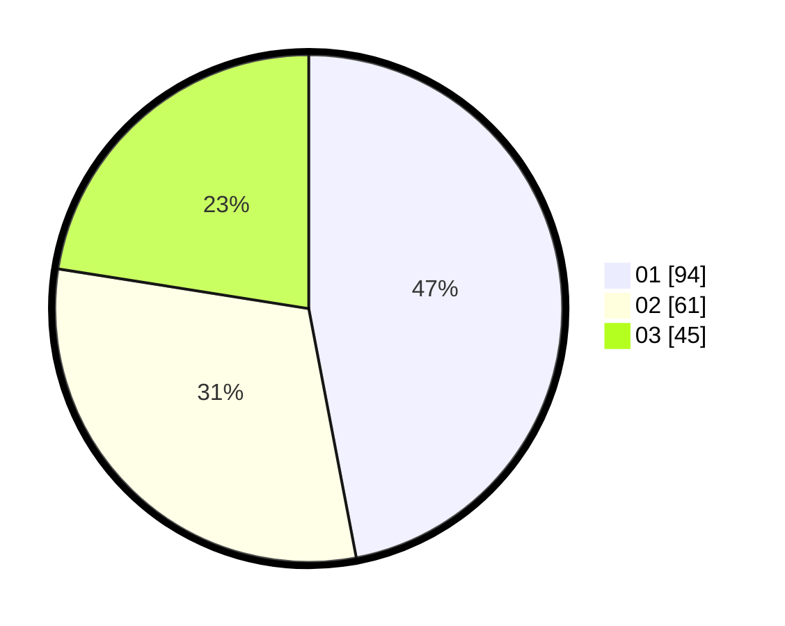

# Hasil

Hasil perolehan suara paslon dapat dilihat pada file paslon-01.txt, paslon-02.txt, dan paslon-03.txt.

Jika tidak ada, artinya data tersebut belum ada pada SIREKAP.

## Perolehan Suara

 * Paslon 01: **94**.
 * Paslon 02: **61**.
 * Paslon 03: **45**.

## Foto C Plano

https://sirekap-obj-formc.kpu.go.id/a8f7/pemilu/ppwp/31/73/08/10/04/3173081004088-20240214-234652--d63faf2b-0e4e-46e2-a7a8-8a6b8ac3bae0.jpg

https://sirekap-obj-formc.kpu.go.id/a8f7/pemilu/ppwp/31/73/08/10/04/3173081004088-20240214-234757--f9556e25-6c11-4ef1-9c03-dd4759d916c9.jpg

https://sirekap-obj-formc.kpu.go.id/a8f7/pemilu/ppwp/31/73/08/10/04/3173081004088-20240214-234854--81195a97-3034-4be1-b069-65153c1ef253.jpg
