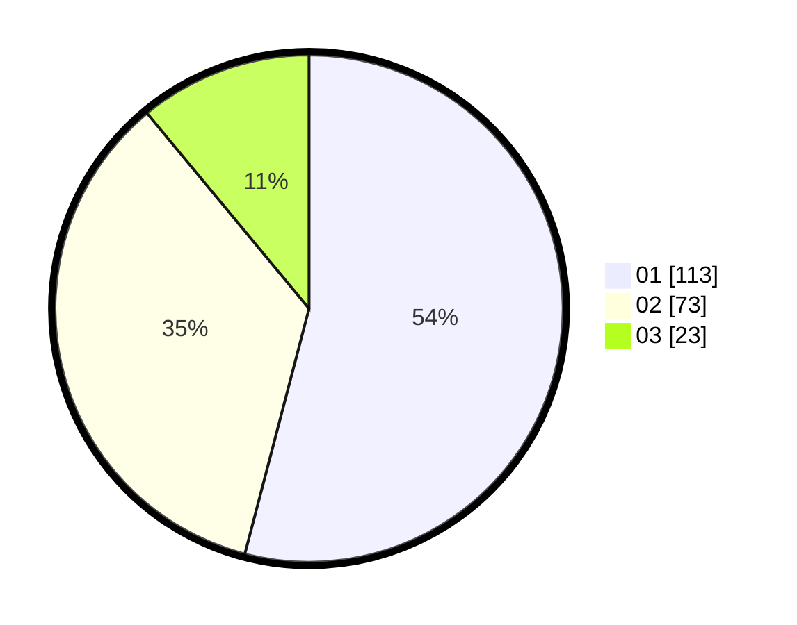

# Hasil

Hasil perolehan suara paslon dapat dilihat pada file paslon-01.txt, paslon-02.txt, dan paslon-03.txt.

Jika tidak ada, artinya data tersebut belum ada pada SIREKAP.

## Perolehan Suara

 * Paslon 01: **113**.
 * Paslon 02: **73**.
 * Paslon 03: **23**.

## Foto C Plano

https://sirekap-obj-formc.kpu.go.id/76af/pemilu/ppwp/31/73/08/10/04/3173081004089-20240214-234654--e67ab81e-6ca7-4055-9eed-eada544cc35b.jpg

https://sirekap-obj-formc.kpu.go.id/76af/pemilu/ppwp/31/73/08/10/04/3173081004089-20240214-234807--493b1d87-0f08-4f9c-94a8-1a757e7bc1c7.jpg

https://sirekap-obj-formc.kpu.go.id/76af/pemilu/ppwp/31/73/08/10/04/3173081004089-20240214-234934--8e79ed25-5bca-4e5b-b217-280911bcd381.jpg
