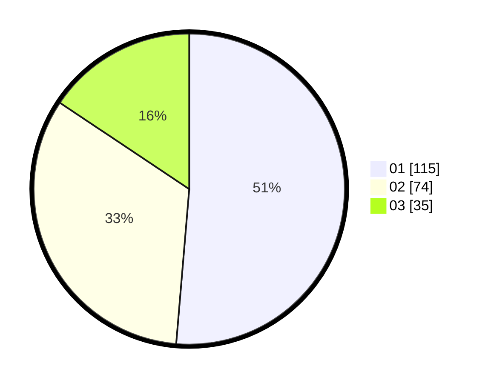

# Hasil

Hasil perolehan suara paslon dapat dilihat pada file paslon-01.txt, paslon-02.txt, dan paslon-03.txt.

Jika tidak ada, artinya data tersebut belum ada pada SIREKAP.

## Perolehan Suara

 * Paslon 01: **115**.
 * Paslon 02: **74**.
 * Paslon 03: **35**.

## Foto C Plano

https://sirekap-obj-formc.kpu.go.id/a227/pemilu/ppwp/31/73/08/10/04/3173081004093-20240214-190251--84d15a91-cf00-469e-9580-a4ad5887672e.jpg

https://sirekap-obj-formc.kpu.go.id/a227/pemilu/ppwp/31/73/08/10/04/3173081004093-20240214-205649--54202105-1305-49e0-980d-b29216d587ad.jpg

https://sirekap-obj-formc.kpu.go.id/a227/pemilu/ppwp/31/73/08/10/04/3173081004093-20240214-205739--75cb4dd7-69d3-4ab5-9db5-b3e76a3725ff.jpg

## DATA PEMILIH TETAP

Jumlah pemilih dalam DPT: **291**.
 * L: **146**.
 * P: **145**.

## DATA PENGGUNA HAK PILIH

Jumlah pengguna hak pilih dalam DPT: **291**.
 * L: **146**.
 * P: **145**.

Jumlah pengguna hak pilih dalam DPTb: **6**.
 * L: **4**.
 * P: **2**.

Jumlah pengguna hak pilih dalam DPK: **3**.
 * L: **0**.
 * P: **3**.

Jumlah pengguna hak pilih: **300**.
 * L: **150**.
 * P: **150**.

## JUMLAH SUARA SAH DAN TIDAK SAH

JUMLAH SELURUH SUARA SAH: **224**.

JUMLAH SUARA TIDAK SAH: **2**.

JUMLAH SELURUH SUARA SAH DAN SUARA TIDAK SAH: **226**.
