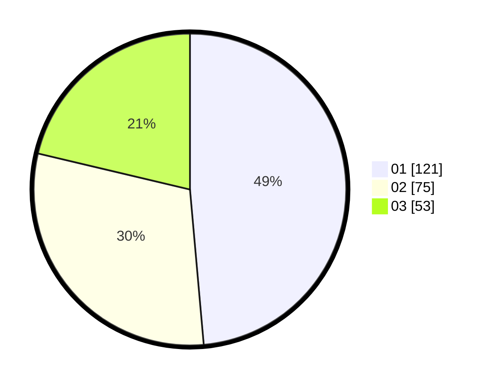

# Hasil

Hasil perolehan suara paslon dapat dilihat pada file paslon-01.txt, paslon-02.txt, dan paslon-03.txt.

Jika tidak ada, artinya data tersebut belum ada pada SIREKAP.

## Perolehan Suara

 * Paslon 01: **121**.
 * Paslon 02: **75**.
 * Paslon 03: **53**.

## Foto C Plano

https://sirekap-obj-formc.kpu.go.id/9ca9/pemilu/ppwp/31/73/08/10/04/3173081004094-20240214-211923--a42aff5b-ee88-4a8a-8ef2-85c0185ca69f.jpg

https://sirekap-obj-formc.kpu.go.id/9ca9/pemilu/ppwp/31/73/08/10/04/3173081004094-20240214-212053--d2b1b1fb-c5e4-4c9d-b929-a80f366107fd.jpg

https://sirekap-obj-formc.kpu.go.id/9ca9/pemilu/ppwp/31/73/08/10/04/3173081004094-20240214-231430--0cc72253-5a09-4ef9-9ae3-9ad77fe43c84.jpg
