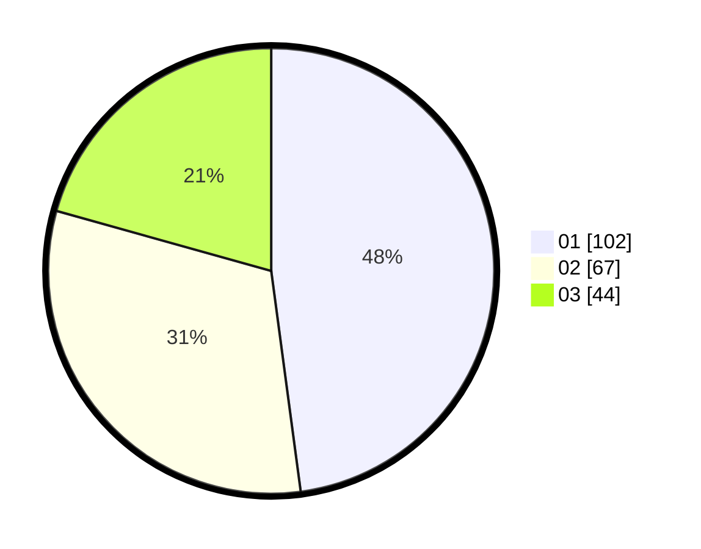

# Hasil

Hasil perolehan suara paslon dapat dilihat pada file paslon-01.txt, paslon-02.txt, dan paslon-03.txt.

Jika tidak ada, artinya data tersebut belum ada pada SIREKAP.

## Perolehan Suara

 * Paslon 01: **102**.
 * Paslon 02: **67**.
 * Paslon 03: **44**.

## Foto C Plano

https://sirekap-obj-formc.kpu.go.id/b2b7/pemilu/ppwp/31/73/08/10/04/3173081004096-20240214-193719--d28fbf77-cbe8-4de0-bc8d-ba971ccd9e34.jpg

https://sirekap-obj-formc.kpu.go.id/b2b7/pemilu/ppwp/31/73/08/10/04/3173081004096-20240214-190048--b394cf4d-a314-41f2-a7f6-7e13b159dac6.jpg

https://sirekap-obj-formc.kpu.go.id/b2b7/pemilu/ppwp/31/73/08/10/04/3173081004096-20240214-193818--f47cceb8-5ec4-4fbf-bbff-7b74882b04e7.jpg
