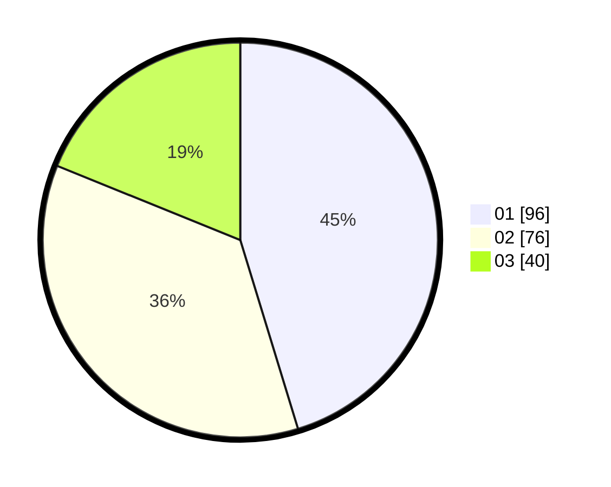

# Hasil

Hasil perolehan suara paslon dapat dilihat pada file paslon-01.txt, paslon-02.txt, dan paslon-03.txt.

Jika tidak ada, artinya data tersebut belum ada pada SIREKAP.

## Perolehan Suara

 * Paslon 01: **96**.
 * Paslon 02: **76**.
 * Paslon 03: **40**.

## Foto C Plano

https://sirekap-obj-formc.kpu.go.id/2960/pemilu/ppwp/31/73/08/10/04/3173081004099-20240214-220112--f65e90be-8e7d-4414-a937-ba9f7fef546b.jpg

https://sirekap-obj-formc.kpu.go.id/2960/pemilu/ppwp/31/73/08/10/04/3173081004099-20240214-220235--a3b8dce8-f92f-4156-8171-0ea74a4c1a0a.jpg

https://sirekap-obj-formc.kpu.go.id/2960/pemilu/ppwp/31/73/08/10/04/3173081004099-20240214-220326--ae810ac6-e47f-43de-91d9-6a86b9d9a17e.jpg

## DATA PEMILIH TETAP

Jumlah pemilih dalam DPT: **266**.
 * L: **128**.
 * P: **138**.

## DATA PENGGUNA HAK PILIH

Jumlah pengguna hak pilih dalam DPT: **210**.
 * L: **102**.
 * P: **108**.

Jumlah pengguna hak pilih dalam DPTb: **3**.
 * L: **1**.
 * P: **2**.

Jumlah pengguna hak pilih dalam DPK: **0**.
 * L: **0**.
 * P: **0**.

Jumlah pengguna hak pilih: **213**.
 * L: **103**.
 * P: **110**.

## JUMLAH SUARA SAH DAN TIDAK SAH

JUMLAH SELURUH SUARA SAH: **212**.

JUMLAH SUARA TIDAK SAH: **1**.

JUMLAH SELURUH SUARA SAH DAN SUARA TIDAK SAH: **213**.
