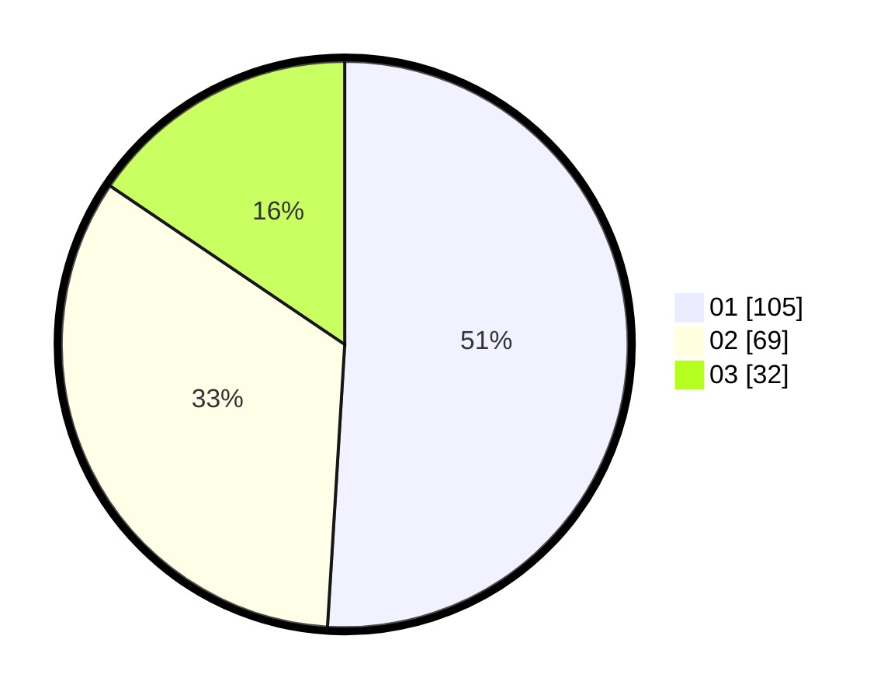

# Hasil

Hasil perolehan suara paslon dapat dilihat pada file paslon-01.txt, paslon-02.txt, dan paslon-03.txt.

Jika tidak ada, artinya data tersebut belum ada pada SIREKAP.

## Perolehan Suara

 * Paslon 01: **105**.
 * Paslon 02: **69**.
 * Paslon 03: **32**.

## Foto C Plano

https://sirekap-obj-formc.kpu.go.id/c933/pemilu/ppwp/31/73/08/10/04/3173081004103-20240215-063855--9b12031b-4087-4ac4-9ed1-1ed8bfb08e00.jpg

https://sirekap-obj-formc.kpu.go.id/c933/pemilu/ppwp/31/73/08/10/04/3173081004103-20240215-064514--50534d70-5f2d-41ee-9c00-3a2562b8a6bd.jpg
