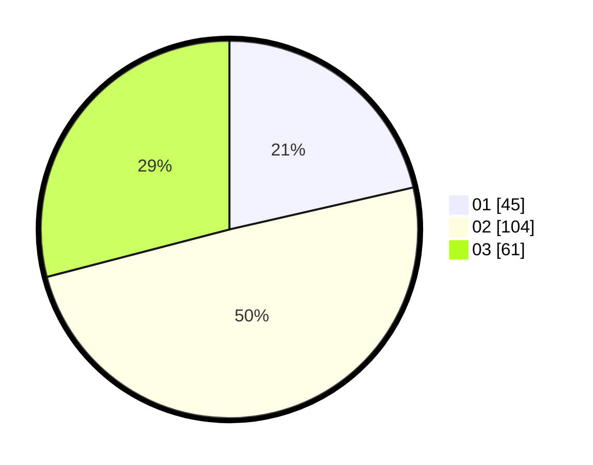

# Hasil

Hasil perolehan suara paslon dapat dilihat pada file paslon-01.txt, paslon-02.txt, dan paslon-03.txt.

Jika tidak ada, artinya data tersebut belum ada pada SIREKAP.

## Perolehan Suara

 * Paslon 01: **45**.
 * Paslon 02: **104**.
 * Paslon 03: **61**.

## Foto C Plano

https://sirekap-obj-formc.kpu.go.id/c360/pemilu/ppwp/31/73/08/10/04/3173081004107-20240215-121627--d87d0c17-50e3-43ab-a2a9-fc557996a67e.jpg

https://sirekap-obj-formc.kpu.go.id/c360/pemilu/ppwp/31/73/08/10/04/3173081004107-20240217-010349--d0450a4f-9d12-4b6d-bc97-923321be5fbe.jpg

https://sirekap-obj-formc.kpu.go.id/c360/pemilu/ppwp/31/73/08/10/04/3173081004107-20240217-010348--4211afcd-c829-40c5-a9e5-a7d7879f07c6.jpg

## DATA PEMILIH TETAP

Jumlah pemilih dalam DPT: **270**.
 * L: **135**.
 * P: **135**.

## DATA PENGGUNA HAK PILIH

Jumlah pengguna hak pilih dalam DPT: **202**.
 * L: **99**.
 * P: **103**.

Jumlah pengguna hak pilih dalam DPTb: **6**.
 * L: **1**.
 * P: **5**.

Jumlah pengguna hak pilih dalam DPK: **7**.
 * L: **4**.
 * P: **3**.

Jumlah pengguna hak pilih: **215**.
 * L: **104**.
 * P: **111**.

## JUMLAH SUARA SAH DAN TIDAK SAH

JUMLAH SELURUH SUARA SAH: **210**.

JUMLAH SUARA TIDAK SAH: **5**.

JUMLAH SELURUH SUARA SAH DAN SUARA TIDAK SAH: **215**.
