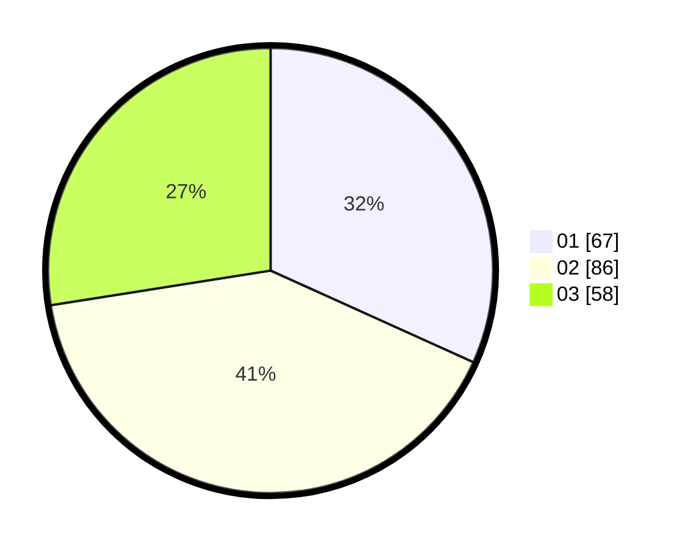

# Hasil

Hasil perolehan suara paslon dapat dilihat pada file paslon-01.txt, paslon-02.txt, dan paslon-03.txt.

Jika tidak ada, artinya data tersebut belum ada pada SIREKAP.

## Perolehan Suara

 * Paslon 01: **67**.
 * Paslon 02: **86**.
 * Paslon 03: **58**.

## Foto C Plano

https://sirekap-obj-formc.kpu.go.id/b269/pemilu/ppwp/31/73/08/10/04/3173081004109-20240216-041923--fd14fd9c-b975-4342-94db-01040ed3f691.jpg

https://sirekap-obj-formc.kpu.go.id/b269/pemilu/ppwp/31/73/08/10/04/3173081004109-20240216-041924--e15c37d1-6c86-4910-bdf0-4bc9073eb853.jpg

https://sirekap-obj-formc.kpu.go.id/b269/pemilu/ppwp/31/73/08/10/04/3173081004109-20240216-041924--e5e1ca38-8143-4c72-abe2-a6972f2ee043.jpg

## DATA PEMILIH TETAP

Jumlah pemilih dalam DPT: **274**.
 * L: **140**.
 * P: **134**.

## DATA PENGGUNA HAK PILIH

Jumlah pengguna hak pilih dalam DPT: **206**.
 * L: **112**.
 * P: **94**.

Jumlah pengguna hak pilih dalam DPTb: **3**.
 * L: **2**.
 * P: **1**.

Jumlah pengguna hak pilih dalam DPK: **4**.
 * L: **2**.
 * P: **2**.

Jumlah pengguna hak pilih: **213**.
 * L: **116**.
 * P: **97**.

## JUMLAH SUARA SAH DAN TIDAK SAH

JUMLAH SELURUH SUARA SAH: **211**.

JUMLAH SUARA TIDAK SAH: **2**.

JUMLAH SELURUH SUARA SAH DAN SUARA TIDAK SAH: **213**.
