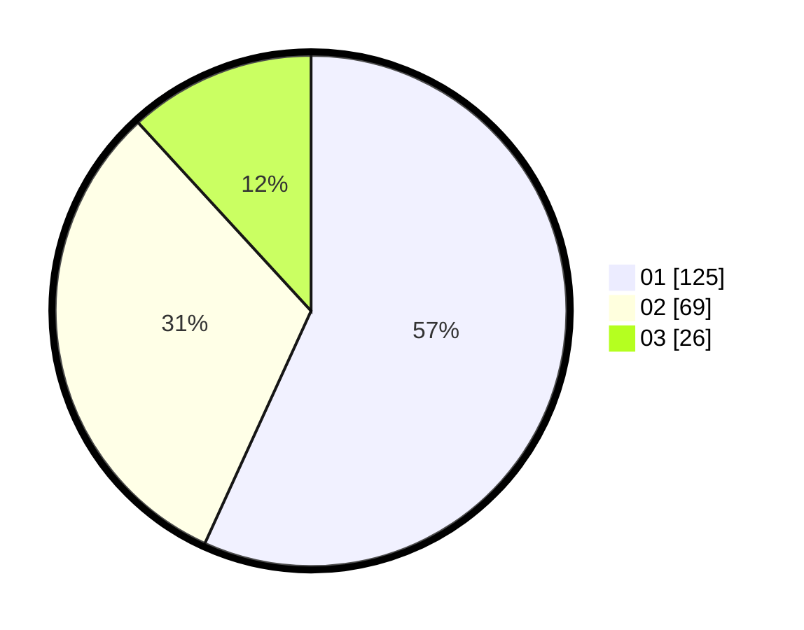

# Hasil

Hasil perolehan suara paslon dapat dilihat pada file paslon-01.txt, paslon-02.txt, dan paslon-03.txt.

Jika tidak ada, artinya data tersebut belum ada pada SIREKAP.

## Perolehan Suara

 * Paslon 01: **125**.
 * Paslon 02: **69**.
 * Paslon 03: **26**.

## Foto C Plano

https://sirekap-obj-formc.kpu.go.id/a007/pemilu/ppwp/31/73/08/10/04/3173081004111-20240216-103349--8cb6afe8-fd0c-4e51-9e34-dcc6cc3dc454.jpg

https://sirekap-obj-formc.kpu.go.id/a007/pemilu/ppwp/31/73/08/10/04/3173081004111-20240216-103530--8c0fe282-86d8-4b99-b6ff-bd02862575b5.jpg

https://sirekap-obj-formc.kpu.go.id/a007/pemilu/ppwp/31/73/08/10/04/3173081004111-20240216-103708--52bf4dc0-50c0-48c4-9716-99658b0d41ab.jpg
