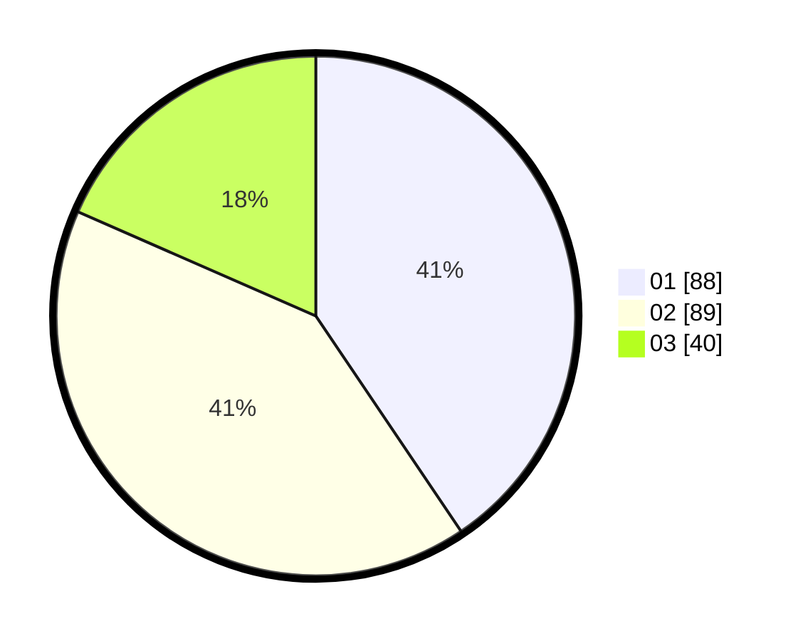

# Hasil

Hasil perolehan suara paslon dapat dilihat pada file paslon-01.txt, paslon-02.txt, dan paslon-03.txt.

Jika tidak ada, artinya data tersebut belum ada pada SIREKAP.

## Perolehan Suara

 * Paslon 01: **88**.
 * Paslon 02: **89**.
 * Paslon 03: **40**.

## Foto C Plano

https://sirekap-obj-formc.kpu.go.id/549f/pemilu/ppwp/31/73/08/10/04/3173081004114-20240215-011146--245128a4-c047-41ff-90cc-d4532ce4c881.jpg

https://sirekap-obj-formc.kpu.go.id/549f/pemilu/ppwp/31/73/08/10/04/3173081004114-20240215-011225--0fb11d75-1556-4473-b6ae-7d00cfc732d9.jpg

https://sirekap-obj-formc.kpu.go.id/549f/pemilu/ppwp/31/73/08/10/04/3173081004114-20240215-011312--e263829a-67df-499c-9788-31e18ce5de0e.jpg

## DATA PEMILIH TETAP

Jumlah pemilih dalam DPT: **268**.
 * L: **132**.
 * P: **136**.

## DATA PENGGUNA HAK PILIH

Jumlah pengguna hak pilih dalam DPT: **224**.
 * L: **113**.
 * P: **111**.

Jumlah pengguna hak pilih dalam DPTb: **1**.
 * L: **1**.
 * P: **0**.

Jumlah pengguna hak pilih dalam DPK: **4**.
 * L: **2**.
 * P: **2**.

Jumlah pengguna hak pilih: **229**.
 * L: **116**.
 * P: **113**.

## JUMLAH SUARA SAH DAN TIDAK SAH

JUMLAH SELURUH SUARA SAH: **217**.

JUMLAH SUARA TIDAK SAH: **12**.

JUMLAH SELURUH SUARA SAH DAN SUARA TIDAK SAH: **229**.
