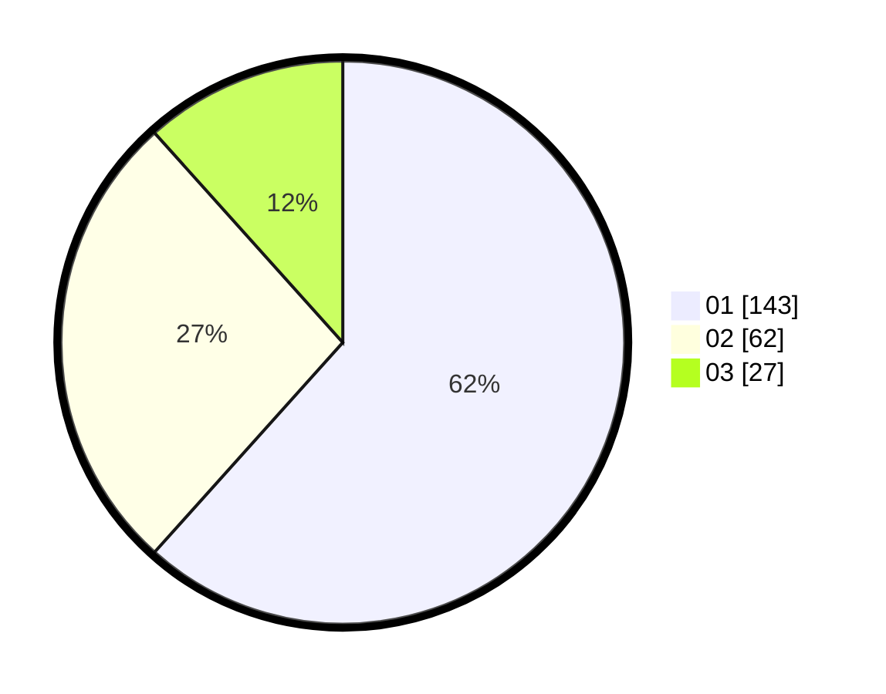

# Hasil

Hasil perolehan suara paslon dapat dilihat pada file paslon-01.txt, paslon-02.txt, dan paslon-03.txt.

Jika tidak ada, artinya data tersebut belum ada pada SIREKAP.

## Perolehan Suara

 * Paslon 01: **143**.
 * Paslon 02: **62**.
 * Paslon 03: **27**.

## Foto C Plano

https://sirekap-obj-formc.kpu.go.id/7e7a/pemilu/ppwp/31/73/08/10/04/3173081004115-20240214-222855--8893fa64-b859-4928-9fbb-41c14374db2e.jpg

https://sirekap-obj-formc.kpu.go.id/7e7a/pemilu/ppwp/31/73/08/10/04/3173081004115-20240214-222911--56f10be0-93df-4ab0-9eeb-4f1b6ee21bf9.jpg

https://sirekap-obj-formc.kpu.go.id/7e7a/pemilu/ppwp/31/73/08/10/04/3173081004115-20240214-222926--5df5feb6-becf-4646-9559-4fc321783d13.jpg
