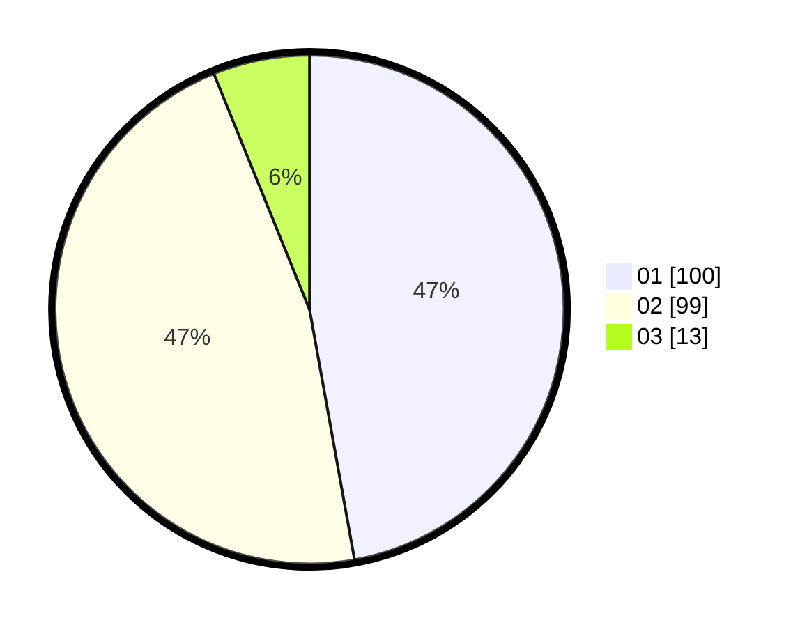

# Hasil

Hasil perolehan suara paslon dapat dilihat pada file paslon-01.txt, paslon-02.txt, dan paslon-03.txt.

Jika tidak ada, artinya data tersebut belum ada pada SIREKAP.

## Perolehan Suara

 * Paslon 01: **100**.
 * Paslon 02: **99**.
 * Paslon 03: **13**.

## Foto C Plano

https://sirekap-obj-formc.kpu.go.id/4796/pemilu/ppwp/31/73/08/10/04/3173081004118-20240215-015200--4c812f1c-5213-425d-ae16-53f94cda411d.jpg

https://sirekap-obj-formc.kpu.go.id/4796/pemilu/ppwp/31/73/08/10/04/3173081004118-20240215-015049--fa80f36a-146a-4e4d-8cb0-403f396eae60.jpg

https://sirekap-obj-formc.kpu.go.id/4796/pemilu/ppwp/31/73/08/10/04/3173081004118-20240215-015128--7831da77-2906-4fee-ae7f-cc3e4eace633.jpg
