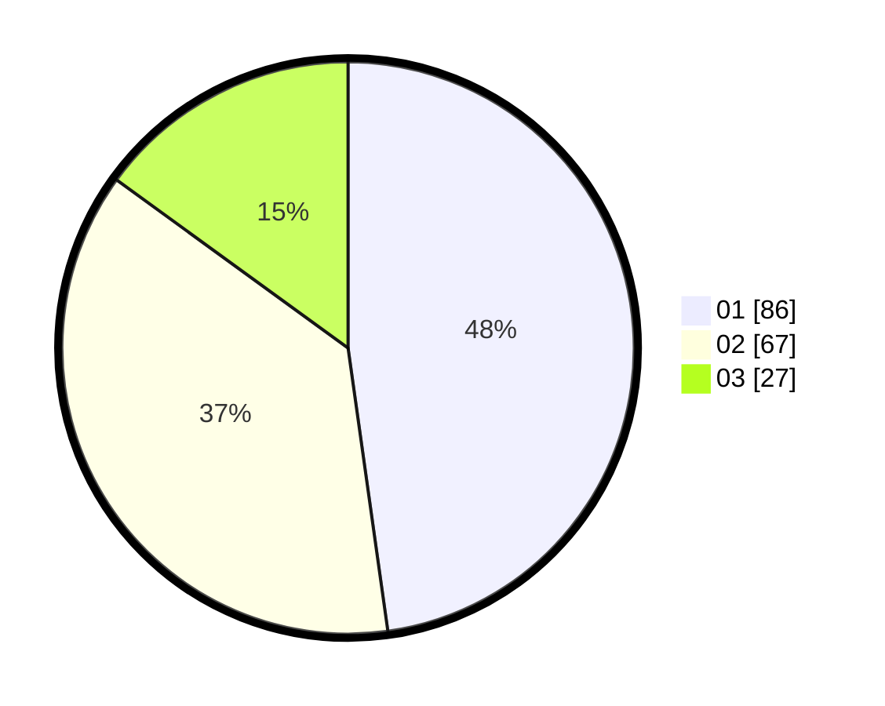

# Hasil

Hasil perolehan suara paslon dapat dilihat pada file paslon-01.txt, paslon-02.txt, dan paslon-03.txt.

Jika tidak ada, artinya data tersebut belum ada pada SIREKAP.

## Perolehan Suara

 * Paslon 01: **86**.
 * Paslon 02: **67**.
 * Paslon 03: **27**.

## Foto C Plano

https://sirekap-obj-formc.kpu.go.id/72e3/pemilu/ppwp/31/73/08/10/04/3173081004120-20240215-022639--4ab91a0c-b8a1-4fb9-bec6-928c2923137e.jpg

https://sirekap-obj-formc.kpu.go.id/72e3/pemilu/ppwp/31/73/08/10/04/3173081004120-20240215-022746--47c61192-38b3-4545-a8cd-645275026b12.jpg

https://sirekap-obj-formc.kpu.go.id/72e3/pemilu/ppwp/31/73/08/10/04/3173081004120-20240215-022842--8d24865c-f990-454d-9e62-4c3c129965c3.jpg
